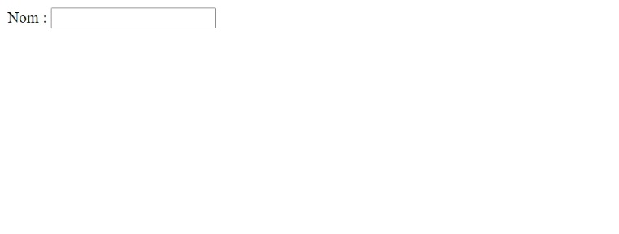
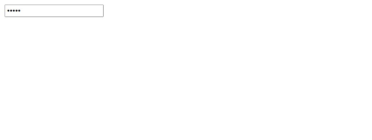
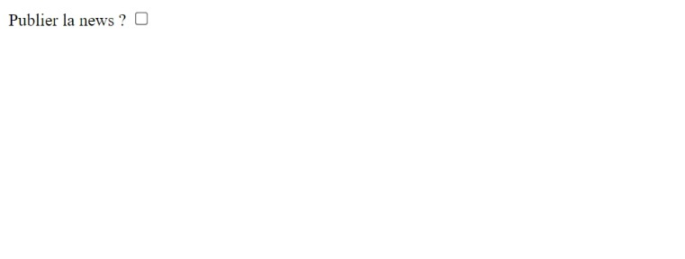
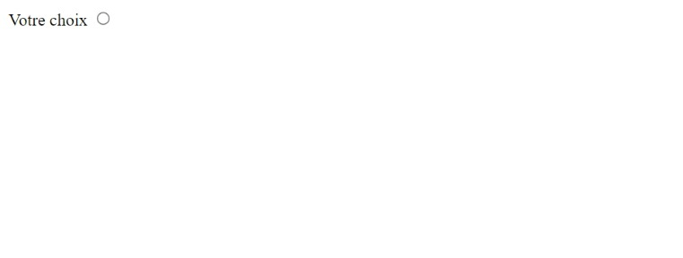
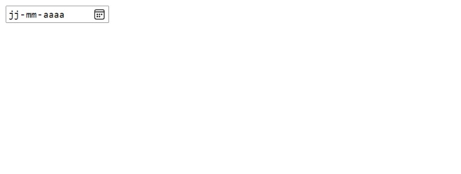
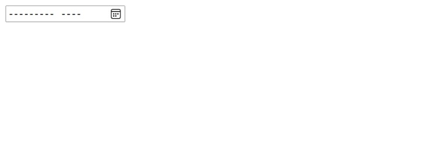
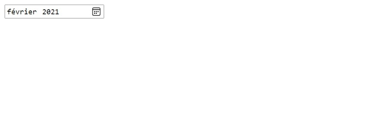
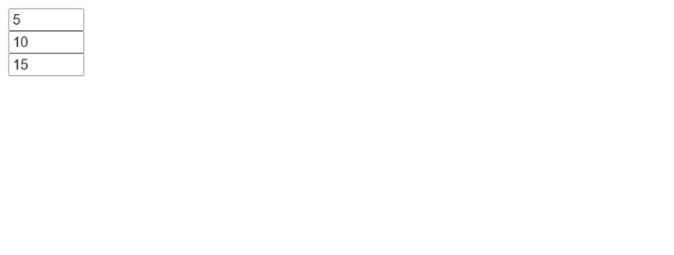
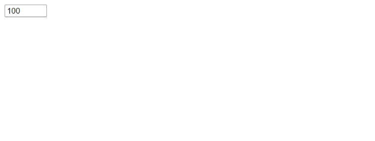
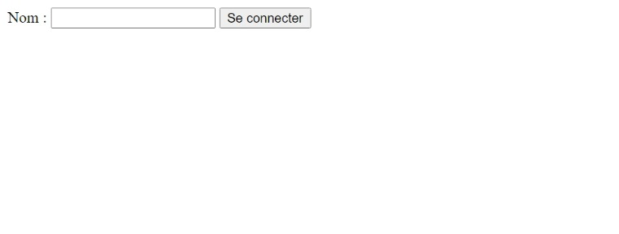

# [9. Fomulaires (1/2)](https://www.youtube.com/watch?v=L6ld1B2Q98Y)
17-01-21

Bonjour à tous bienvenue sur la formation html et css, dans cette vidéo numéro 9 et la vidéo suivante la numéro 10 que nous aurons l'occasion de voir nous allons aborder les formulaires donc je mets ça sur deux vidéos parce qu'il va y avoir beaucoup de choses à voir et je prendrai comme ça le temps de vous expliquer tout ce qui concerne en fait autour des formulaires avec pas mal d'utilisation de balises notamment d'attributs.

Il va y avoir beaucoup beaucoup d'attributs, il y aura certaines choses qu'on ne pourra pas voir bien évidemment mais vous en faites pas je vous redirigerait là où il faut pour vous renseigner un petit peu sur tout ça et notamment en tout cas ici parler des cas les plus courants pour ce code-là alors on va aborder ça.
```html
	<!DOCTYPE html>
	<html lang="fr">
	<head>
		<meta charset="UTF-8">
		<title>Formulaire (1/2)</title>
	</head>
	<body>
		
	</body>
	</html>
```
Voilà qu'est ce qu'un formulaire je pense qu'on peut commencer par là, c'est la base tout simplement, ce qui semble le plus logique.

Un formulaire c'est le genre de choses que vous avez très certainement déjà rempli sur un site web alors bon déjà au format papier, ce qui a dû arriver pour des démarches administratives mais également sur internet peut-être pour demander par exemple un document d'identité, faire une commande d'un article sur internet donc du shopping sur internet ou l'inscription tout simplement sur un site internet voilà mon inscription sur un réseau social ou autre, vous êtes passé par un formulaire.

Dans tous les cas pour créer un compte google vous êtes passé pareil pour youtube par un formulaire également donc avec un ensemble de champs de saisie, des boutons de validation tout ça.

Voilà ceci donc ce sont en tout cas des formulaires que vous avez pu utilisé au cours de votre navigation sur internet et je vais vous montrer comment enn produire, comment en générer un formulaire, comment on créer un donc je rappelle que le langage html est un langage informatique c'est pas un langage en fait de programmation d'accord il permet via un système de balises de tout simplement créer des pages web mais ne permet pas de faire de la programmation.

Donc au niveau des données le formulaire vous allez pouvoir le créer pas de souci, on va pouvoir saisir des informations par contre tout ce qui concerne la récupération, la vérification donc le filtrage etc de toutes les informations pour les exploiter doit se faire et devra se faire obligatoirement avec un langage bien évidemment de programmation donc un langage dynamique.

Le plus courant c'est évidemment le langage php, vous avez d'ailleurs une formation sur ma chaîne à ce langage là et maintenant donc à cette période là en tout cas nous avons même javascript qui peut être utilisé côté serveur notamment avec nodejs donc il y a des solutions comme ça côté serveur même avec des langages qui à l'époque n'était utilisable que côté client pour s'occuper de tout ce qui est vérification de données dans tous les cas ici on va juste voir comment se charger de créer des formulaires mais on ne verra pas évidemment la partie traitement.

Tout ce qui est traitement récupération vous pouvez notamment le retrouver sur la formation php et sur d'autres formations liées au web qu'il y a ou qu'il y aura à l'avenir sur ma chaîne voilà.

La balise est toute simple d'accord pour faire des formulaires comme le nom le voudrait de toute manière la balise va s'appeler `<form>` donc c'est aussi simple que ça.
```html
	<!DOCTYPE html>
	<html lang="fr">
	<head>
		<meta charset="UTF-8">
		<title>Formulaire (1/2)</title>
	</head>
	<body>
		<form>
		
		</form>
	</body>
	</html>
```
On va créer un ensemble de balises `<form>` qui bien évidemment s'ouvre et se ferme ici pour pouvoir y accueillir notre formulaire d'accord on va avoir un certain nombre d'attributs et ça j'en parle, je ne pourrais pas tous les citer mais de toute façon je vous redirigerais encore une fois au bon endroit pour retrouver toutes les informations complètes par rapport aux standards par rapport voilà au w3c qui spécifie toutes les recommandations et les standards concernant ce langage et on verra un petit peu encore une fois l'essentiel dans cette vidéo.

Alors le premier attribut qui va être utile de savoir c'est l'attribut de la méthode donc la méthode d'envoi des données donc on va l'appeler method="" comme ceci tout simplement et on va choisir une valeur selon le type de gestion donc pour le traitement des données donc même si on ne va pas faire de traitement c'est bien quand même de le voir maintenant pour savoir qu'il y a l'un ou l'autre. On à l'attribut, la valeur par défaut qui est "get" qui va tout simplement ajouter des éléments du formulaire donc toutes les données qu'il y aura du formulaire seront ajoutées en fait au niveau de l'url de votre page. 
```html
<!DOCTYPE html>
<html lang="fr">
<head>
	<meta charset="UTF-8">
	<title>Formulaire (1/2)</title>
</head>
<body>
	<form method="get">
	
	</form>
</body>
</html>
```
Quand vous allez valider votre formulaire, vous aurez à la suite ici du nom de la page selon où vous allez rediriger votre formulaire la liste des éléments d'accord donc on va par exemple faire un point d'interrogation, puis on va avoir le champ 1 d'accord de votre formulaire qui aura une valeur d'accord donc je met valeur 1 et si il y en a plusieurs ils seront séparés par le petit & commercial donc on aura par exemple champ 2 qui aura du coup avec une valeur à lui et cetera et cetera.

	file:///C:/Users/Jason/Desktop/index.html?champ1=valeur1&champ2=valeur2&...

Je pense que vous avez compris un petit peu le principe à ce niveau là.

Voilà pour notre formulaire donc ça c'est par défaut, c'est la méthode get d'accord qui va s'utiliser pour ça on peut également sinon directement fournir les données avec l'envoi du formulaire c'est à dire avec le formulaire qui est envoyé, on y injecte les données et pour cela on va utiliser la méthode post voilà.
```html
<!DOCTYPE html>
<html lang="fr">
<head>
	<meta charset="UTF-8">
	<title>Formulaire (1/2)</title>
</head>
<body>
	<form method="post">
	
	</form>
</body>
</html>
```
Tout dépendra selon les types de formulaires par exemple si vous voulez faire un moteur de recherche, un petit moteur de recherche en général on va utiliser "get", l'avantage c'est que comme ça les mots clés de recherche seront directement ici en fait inscrit dans l'url, google par exemple fait, DuckDuckGo fait ça voilà il y a plein de moteurs de recherche, je pense même tous fonctionnent par ce système là, utilisent la méthode "get" pour tout ce qui est requête au niveau de leurs moteurs de recherche.

Par contre si on veut passer énormément d'informations puisque vous savez que les url ont une taille limitée comme je l'avais expliqué évidemment on va passer par la méthode "post" qui va permettre d'injecter tout ça directement dans le formulaire quand nous allons l'envoyer.

Alors je me suis un peu attardé là dessus mais c'est quand même des choses à connaître parce que même si c'est la base des formelaire, ce des choses sur lesquels les gens se trompent souvent donc je tenais à prendre le temps de les expliquer puisque c'est vraiment important de ne pas se tromper, de savoir pourquoi on utilise un et pourquoi on utilise l'autre.

En deuxième attribut donc en 2e argument, appelez ça comme vous voulez mais c'est un attribut, on va passer l'action.

L'action c'est simplement la destination, où est-ce qu'on va envoyer ce formulaire donc nous ici on s'en fiche un petit peu puisque comme on ne va pas faire de traitement, on n'est pas encore une fois sur un langage de programmation, on peut imaginer une page de résultats par exemple si c'était du php j'aurais éventuellement une page résultats "result.php" ou une autre page peu importe, une vérification on s'en fiche d'accord au niveau de sa donc nous on met n'importe quoi.
```html
	<form method="post" action="result.php">
	
	</form>
```
mais ici moi comme il y aura rien je peux laisser par défaut ça va en fait redirigé directement sur index.html où je peux mettre un # pour rediriger sur rien.
```html
	<form method="post" action="#">
	
	</form>
```
Je vais laisser action="" pour dire qu'il se redirige sur lui-même.
```html
<!DOCTYPE html>
<html lang="fr">
<head>
	<meta charset="UTF-8">
	<title>Formulaire (1/2)</title>
</head>
<body>
	<form method="post" action="">
	
	</form>
</body>
</html>
```
Comme ça voilà l'action arrive sur la page elle même et à l'intérieur on va pouvoir du coup spécifier quelques informations.

On va voir quand même d'autres attributs je pense que je peux vous en parler assez rapidement parce qu'ils ont leur utilité.

On peut évidemment mais ça c'est un attribut universel j'en ai parlé de toute façon vous pourrais aller voir dans les tutoriels html css, il y a pas mal de choses disponible notamment sur les attributs universels c'est à dire que vous pouvez utiliser sur toutes les balises html.

Donc l'attribut 'name' tout simplement pour pouvoir nommer votre formulaire donc vous pouvais lui donner un nom d'accord moi je vais l'appeler avec "MonFormulaire" par exemple.
```html
<!DOCTYPE html>
<html lang="fr">
<head>
	<meta charset="UTF-8">
	<title>Formulaire (1/2)</title>
</head>
<body>
	<form method="post" action="" name="MonFormulaire">
	
	</form>
</body>
</html>
```
On peut également spécifier où va être envoyé le formulaire au niveau du contexte, je parle de contexte puisque on est en html5 donc c'est des contextes de navigation et non plus des frames donc des fenêtres donc dire où est ce qu'on va en fait et comment on va afficher en fait le résultat donc l'envoi de notre formulaire. On va utiliser pour cela l'attribut 'target' et on va pouvoir y passer tout un nombre d'éléments, par défaut il est égal à _self donc si c'est pas _self vous ne mettez pas parce que c'est comme ça que c'est défini par défaut.
```html
	<form method="post" action="" name="MonFormulaire" target="_self">
	
	</form>
```
```html
<!DOCTYPE html>
<html lang="fr">
<head>
	<meta charset="UTF-8">
	<title>Formulaire (1/2)</title>
</head>
<body>
	<form method="post" action="" name="MonFormulaire" target="">
	
	</form>
</body>
</html>
```
On peut également l'envoyer éventuellement à un contexte parent càd qui serait celui d'avant.
```html
<!DOCTYPE html>
<html lang="fr">
<head>
	<meta charset="UTF-8">
	<title>Formulaire (1/2)</title>
</head>
<body>
	<form method="post" action="" name="MonFormulaire" target="_parent">
	
	</form>
</body>
</html>
```
On peut l'envoyer au tout premier contexte donc les toutes premières pages en réalité ... pour être un peu plus clair pour vous ... de votre site web donc du coup on utiliserait top.
```html
<!DOCTYPE html>
<html lang="fr">
<head>
	<meta charset="UTF-8">
	<title>Formulaire (1/2)</title>
</head>
<body>
	<form method="post" action="" name="MonFormulaire" target="_top">
	
	</form>
</body>
</html>
```
Et si on veut l'ouvrir tout simplement dans un nouvel onglet du navigateur on va le passer avec _blank donc ça on l'avait vu sur les liens si vous vous souvenez avec la balise `<a>`. On avait vu ce cet attribut target qui peut fonctionner comme ça donc j'en parle parce qu'on peut le faire sur un formulaire.
```html
<!DOCTYPE html>
<html lang="fr">
<head>
	<meta charset="UTF-8">
	<title>Formulaire (1/2)</title>
</head>
<body>
	<form method="post" action="" name="MonFormulaire" target="_blank">
	
	</form>
</body>
</html>
```
Là par exemple ça veut dire que ici l'envoi de formulaire se fera du coup dans un nouvel onglet de mon navigateur internet tout simplement.

Moi par défaut je ne veux pas m'embêter, je vais laisser comme ceci et le nom d'ailleurs je peux l'enlever c'était pour vous montrez que vous sachiez que ce existe et voilà.
```html
	<form method="post" action="">
	
	</form>
```
On a également un autre attribut intéressant qui est le autocomplete ça j'en parle puisque ça maintenant en 2018 surtout c'est intéressant de se mettre à des choses modernes au niveau des formulaires, d'utiliser les derniers standards du langage html et 'autocomplete' c'est tout simplement pour activer ou non l'auto complétion du formulaire  en mettant "on" ou en mettant "off".
```html
<!DOCTYPE html>
<html lang="fr">
<head>
	<meta charset="UTF-8">
	<title>Formulaire (1/2)</title>
</head>
<body>
	<form method="post" action="" autocomplete="off">
	
	</form>
</body>
</html>
```
Si votre navigateur a enregistré d'accord certains champs et bien en mettant à "on" automatiquement il va auto compléter un formulaire et des fois ça peut faire gagner beaucoup beaucoup de temps donc vous pouvez faire comme ça, décider sur tout l'ensemble du formulaire en utilisant l'attribut autocomplete à ce niveau là.
```html
	<form method="post" action="" autocomplete="on">
	
	</form>
```
Voilà ça peut être utile enfin je voulais vous parler mais ça je vais aller très vite puisque ça va concerner autre chose, c'est quelque chose qu'on verra en annexe d'accord en complément sur un tuto qui est peut être même déjà publié la chaîne moment au moment où vous regardez cette vidéo qui sait après au moment où je l'enregistre, elle n'y est pas. C'est au sujet pour les formulaires d'envoi où on va utiliser l'attribut 'enctype'.
```html
	<form method="post" action="" enctype="">
	
	</form>
```
'enctype' va permettre en fait de spécifier un type mime qui va définir en fait l'identité d'un type de fichier si c'est un pdf, si c'est un fichier n'importe quoi en fait, un exécutable, une archive ou autre mais ça pareil je passe très vite dessus, ça concernera surtout les formulaires d'envoi de fichiers d'accord si on veux faire un formulaire uplaud mais ce n'est pas le thème de cette vidéo.
```html
<!DOCTYPE html>
<html lang="fr">
<head>
	<meta charset="UTF-8">
	<title>Formulaire (1/2)</title>
</head>
<body>
	<form method="post" action="" enctype="">
	
	</form>
</body>
</html>
```
Et on a d'autres attribut, on a par exemple accept-charset="" qui permet de spécifier plusieurs encodage donc en mettant bien évidemment en premier celui que vous préférez par défaut donc ça peut être "UTF-8 ", on peut mettre un espace pour mettre je ne sais pas "iso ... 58 ... 89 ... 1" je ne sais plus fin bref.
```html
<!DOCTYPE html>
<html lang="fr">
<head>
	<meta charset="UTF-8">
	<title>Formulaire (1/2)</title>
</head>
<body>
	<form method="post" action="" accept-charset="UTF-8">
	
	</form>
</body>
</html>
```
Bon c'est pareil c'est pas spécialement utile si votre page de toute façon est encodé en utf-8 en général ça ne lui pose pas trop de souci il gère très bien les choses en utf-8 également donc moi j'ai pour habitude d'utiliser surtout 'method', 'action' comme attributs pour les formulaires, 'autocomplete' éventuellement si je spécifie quelque chose de précis et voilà.

Comme ça c'est assez clair donc pareil, j'ai pris le temps de bien vous expliquer toute façon il y a deux vidéos sur les formulaires et cette vidéo on va parler que d'une seule balise en fait puisque c'est pour ça que je vous ai dit qu'on a beaucoup beaucoup de choses à voir et bien dans cette vidéo on va voir qu'une seule balises en fait en plus de form donc on n'aura pas vu beaucoup de balises mais par contre on va voir beaucoup d'attributs.

Donc voilà pour la base donc évidemment si j'actualise la page vous n'allez rien voir du tout pourtant vous voyez que le code source a bien été pris en compte donc il n'y a pas de souci.

Donc on va commencer a ajouter des éléments.

Pour cela on va tout simplement s'occuper de mettre un champ de saisie au niveau de notre formulaire, pour cela on va utiliser la fameuse balise `<input>` comme ceci on va y placer des choses et par défaut on va lui mettre un nom et c'est bien de toujours lui mettre un nom parce que ça va être important pour la récupération des données. S'il n'y a pas de nom pour votre champ ça va être galère pour travailler dessus donc ça prenez l'habitude le nom, de toute façon il est obligatoire et il faut le mettre c'est vraiment important pour la récupération donc on met le nom. Moi je met par exemple "username", ce genre de choses et je vais y spécifier quelque chose. ici je met un petit texte avant je met comme ceci, Nom :
```html
<!DOCTYPE html>
<html lang="fr">
<head>
	<meta charset="UTF-8">
	<title>Formulaire (1/2)</title>
</head>
<body>
	<form method="post" action="">
		Nom : <input name="username">
	</form>
</body>
</html>
```
Là je ne m'embête pas trop au niveau de la présentation, vous verez que par défaut, rappelez-vous html n'est pas fait pour faire de la mise en page, on n'aura pas quelque chose de très joli mais encore une fois le but ici c'est de voir la sémantique, la partie contenu plus que la mise en page, le design.

Donc `<input name="username">` ensuite on actualise et dès le début nous avons notre petit texte avec le champ de saisie ou je peux évidemment écrire le nom dedans sans problème, ça fonctionnera d'accord donc ça pas de souci.

Du coup ce qui est important de voir par rapport à ça c'est que nous allons pouvoir renseigner beaucoup beaucoup beaucoup d'informations notamment via des attributs au niveau de ce champ `<input>` d'accord donc ça c'est vraiment important.

Alors déjà pour faire plus proprement au niveau du texte ici nous allons en faire un label.

Un label ça va être beaucoup plus pratique notamment pour ceux qui travaillent aux claviers, des gens qui ne peuvent pas utiliser la souris ou autre, qui naviguent exclusivement avec un clavier du coup c'est très important de spécifier certains champs précis, de faire les choses proprement pour qu'on puisse utiliser un formulaire par exemple seulement au clavier qu'on ai même pas besoin à la rigueur de la souris pour le faire.

Alors je ne montrerais pas tout, tout ce qui est question d'accessibilité parce que malheureusement ça prend énormément énormément de temps mais fort heureusement les navigateurs maintenant gèrent déjà beaucoup de choses par défaut donc on va dire qu'ils ont allégé le travail des développeurs donc ça c'est plutôt bien surtout pour les gens encore une fois qui peuvent avoir des difficultés physiques moteur pour naviguer tout simplement sur internet, remplir ne serait-ce qu'un formule.

Donc là on va juste utiliser une autre balise donc ce sera exceptionnelement on va voir celui-là quand même, qui est la balise `<label>` et on va l'appeler avec l'attribut 'for' et on va mettre par exemple quelque chose comme "prenom" voilà pour bien différencier et on entoure bien le texte Nom : d'accord.
```html
	<form method="post" action="">
		<label for="prenom">Nom</label> <input name="username">
	</form>
```
Et donc on peut mettre un attribut 'for' avec ici un identificateur "prenom" en fait et du coup pour le lier avec un champ en particulier il suffit d'utiliser un attribut l'universel encore une fois qui est 'id' et en mettant le même nom "prenom".
```html
<!DOCTYPE html>
<html lang="fr">
<head>
	<meta charset="UTF-8">
	<title>Formulaire (1/2)</title>
</head>
<body>
	<form method="post" action="">
		<label for="prenom">Nom</label> <input id="prenom" name="username">
	</form>
</body>
</html>
```
Voilà donc c'est important pour le label le nom "prenom" ici au niveau du 'for' doit être le même qu'au niveau du 'id' pour l'input comme ça si je fait tab il me donne directement le focus sur le champ de saisie donc j'ai pas besoin de la souris en fait pour le faire.

Je réactualise tout simplement hop j'appuie sur la touche tab et j'arrive sur le formulaire ça peut être tout à fait pratique et encore une fois vous allez vraiment faciliter le travail en tout cas la saisie pour ceux qui n'utilise pas la souris donc ça c'est des choses à savoir donc tout simplement.

Et là on peut mettre deux points et présenter ainsi.
```html
	<form method="post" action="">
		<label for="prenom">Nom</label> : <input id="prenom" name="username">
	</form>
```
Voilà pour faire une petite présentation avec vos deux points ça c'est vous qui voyez au niveau de la présentation.

Voilà donc on va dire pour ce qui est le strict minimum d'accord on va faire les choses proprement après on peut même encore faire mieux, pourquoi pas c'est de mettre carrément des balises paragraphe `<p>` à chaque fois si on veut mettre par exemple un champ par ligne.
```html
<!DOCTYPE html>
<html lang="fr">
<head>
	<meta charset="UTF-8">
	<title>Formulaire (1/2)</title>
</head>
<body>
	<form method="post" action="">
		<p><label for="prenom">Nom</label> : <input id="prenom" name="username"></p>
	</form>
</body>
</html>
```

Voilà `<p>` si on veut mettre un champ par ligne comme ça plus tard on pourra le mettre en page correctement avec du css comme on le verra dans les vidéos prochainement donc là on a vraiment quelque chose de simple encore une fois voyez c'est vraiment par défaut mais les informations en tout cas principales sont transcrits.

On peut également et ça c'est aussi un attribut qu'on peut retrouver sur pas mal de balises qui est l'attribut 'placeholder'.
```html
	<form method="post" action="">
		<p><label for="prenom">Nom</label> : <input id="prenom" name="username" placeholder=""></p>
	</form>
```
Tout simplement aussi puisqu'il va permettre de spécifier un texte par défaut alors c'est pas forcément un texte par défaut dans le champ, c'est plus quelque chose qui va vous guider pour dire par exemple ici "Entrez votre nom..." et vous actualisez.
```html
<!DOCTYPE html>
<html lang="fr">
<head>
	<meta charset="UTF-8">
	<title>Formulaire (1/2)</title>
</head>
<body>
	<form method="post" action="">
		<p><label for="prenom">Nom</label> : <input id="prenom" name="username" placeholder="Entrez votre nom..."></p>
	</form>
</body>
</html>
```

J'actualise et voyez il met un texte dedans, on pourrait penser que c'est un texte qu'il faut que j'enlève de mon champ mais regardez en fait quand je fais le curseur voyez il l'enlève tout seul.

Si j'éfface tout, il va réafficher le 'placeholder' donc c'est pas du texte qui est déjà mis à l'intérieur du champ c'est juste voilà un petit modèle, un petit schéma pour vous guider, une petite description pour savoir quoi mettre dans ce champ donc c'est plutôt très pratique à ce niveau là voilà.

Donc là on a tout ici le 'placeholder' et cetera.

Et on va voir maintenant un autre attribut qui est du coup l'attribut qui possède énormément de valeur et c'est pour ça que je voulais faire une première partie juste sur ça qui est l'attribut 'type' parce que là on n'a pas dit le type du champ de saisie et c'est un peu embêtant.

Rappelez vous qu'en html l'important c'est d'avoir quelque chose de sémantiquement correcte pour que ça puisse énormément aider les moteurs de recherche, tous les robots en fait qui vont analyser vos pages et de rendre l'information beaucoup plus pertinente donc on va avoir notre fameux attribut 'type' comme ceci avec une valeur et là les valeurs il y en a beaucoup beaucoup beaucoup beaucoup.
```html
	<form method="post" action="">
		<p><label for="prenom">Nom</label> : <input id="prenom" name="username" type="" placeholder="Entrez votre nom..."></p>
	</form>
```
Donc déjà je vais virer tout ce que j'ai fait là histoire de gagner du temps et que ce soit beaucoup plus lisible pour vous bon j'enlève tout ça d'accord.
```html
	<form method="post" action="">
		<input type="" name="champFormulaire">
	</form>
```
Je vais mettre 'type' pas de soucis et je remettre 'name' donc voilà au niveau 'type' donc ça c'est la base et ici au niveau de l'attribut 'type', on va pouvoir lui mettre énormément énormément énormément de valeurs, il y a vraiment plein de choses toujours en fonction du type de champ de saisie que vous allez vouloir gérer.

Par défaut le plus courant c'est le type "text" donc c'est en anglais rappelez-vous donc pas de e à la fin.
```html
<!DOCTYPE html>
<html lang="fr">
<head>
	<meta charset="UTF-8">
	<title>Formulaire (1/2)</title>
</head>
<body>
	<form method="post" action="">
		<input type="text" name="champFormulaire">
	</form>
</body>
</html>
```

Là vous allez gérer un texte standard d'accord pas de problème, bien sûr voilà il n'y aura pas de souci à ce niveau là pour gérer le texte donc ça c'est des choses à savoir.

On peut également spécifier, ça j'en parle parce que c'est quand même assez récurrent sur les formulaires sur internet, un champ pour les mots de passe qui va être du coup en valeur "password" tout simplement.
```html
<!DOCTYPE html>
<html lang="fr">
<head>
	<meta charset="UTF-8">
	<title>Formulaire (1/2)</title>
</head>
<body>
	<form method="post" action="">
		<input type="password" name="champFormulaire">
	</form>
</body>
</html>
```

Là c'est la même chose sauf que vous voyez je n'affiche rien tout simplement `*****` donc ça se remplit comme ça par défaut, ça permet de masquer en fait les caractères pour saisir un mot de passe mais ça c'est des choses que vous avez déjà vu, vous avez probablement de toute manière déjà utilisé, déjà pratiqué sur un site quelconque quand vous êtes inscrit par exemple dessus.

Deux choses intéressantes à savoir, "text", "password" ça c'est vraiment la base.

Après on va avoir d'autres types également et du coup rendre les choses un peu plus complexe.

Alors il y a des types je ne vais pas parler parce que c'est pas forcément utile tout de suite càd que là au niveau où vous en êtes, il y a plein de types qui honnêtement vous seront complètement inutile donc je vais vraiment parler de ceux qu'on retrouve pas mal.

Il y a le type "checkbox", celui là, il est bien à connaître que je vais noter par exemple comme ceci. Je vais noter : Publier la news ? mais je ne met pas de `<label>` tout ça, je ne met pas de label.
```html
<!DOCTYPE html>
<html lang="fr">
<head>
	<meta charset="UTF-8">
	<title>Formulaire (1/2)</title>
</head>
<body>
	<form method="post" action="">
		Publier la news ? <input type="checkbox" name="publishNews">
	</form>
</body>
</html>
```

Vous allez avoir un champ comme ceci tout simplement, une case à cocher donc c'est pas obligatoire comme ça vous pouvez lui préciser et éventuellement une valeur donc "publishNews", veut simplement dire si je la publier par exemple je coche.

Si elle n'est pas cochée dans tous les cas, ce ne sera pas publié.

On peut gérer ce genre de choses donc c'est une case à cocher mais c'est pas obligatoire d'accord, c'est une case optionnel à cocher.

Si on veut avoir quelque chose d'obligatoire, on peux utiliser le type "radio" comme ceci et là on va l'appeler "choice", c'est très très recherché ici.
```html
	<form method="post" action="">
		Votre choix <input type="radio" name="choice">
	</form>
```
'value' donc là, je peux mettre oui pourquoi pas.
```html
<!DOCTYPE html>
<html lang="fr">
<head>
	<meta charset="UTF-8">
	<title>Formulaire (1/2)</title>
</head>
<body>
	<form method="post" action="">
		Votre choix <input type="radio" name="choice" value="oui">
	</form>
</body>
</html>
```

Si je met comme ceci, on a pas de texte bien évidemment.

Voyez que par défaut si je clic après je ne peux plus l'enlever parce que là ça va être un choix obligatoire.

Moi ce que je vais faire plutôt que de mettre un 'value' ici bien sûr pour que soit beaucoup plus clair, je vais mettre un oui.. après et je vais mettre un non... ensuite.
```html
<!DOCTYPE html>
<html lang="fr">
<head>
	<meta charset="UTF-8">
	<title>Formulaire (1/2)</title>
</head>
<body>
	<form method="post" action="">
		Votre choix <input type="radio" name="choice"> Oui <input type="radio" name="choice"> Nom
	</form>
</body>
</html>
```

Alors là du fait que mes deux champs "radio" ont le même nom voyez 'name' c'est "choice" des deux cotés, automatiquement je ne peux que sélectionner qu'un des deux d'accord.

Alors il faudrait utiliser bien sûr un attribut "name" et cetera mais encore une fois pour la récupération de données ... encore une fois pour ne pas trop allonger sur la vidéo, je ne vais pas vous montrer tout ça parce que de toute façon on ne fera pas de récupération.

Je vous montre donc juste comment ça fonctionne au niveau du type de champ puisqu'il en a vraiment beaucoup donc je ne vais pas trop trop perdre de temps là-dessus mais vous en faites pas, le fonctionnement concret, correct on le verra surtout au niveau traitement et récupération des données.

Là de toute façon comme on fera un formulaire qui fonctionne vraiment qu'on va utiliser, on fera le code vraiment comme il faut pour que ça fonctionne et que ce soit récupérables par la suite.

Donc là voyez on peut du coup récupérer les 2 données de cette manière.

Alors si le texte est gros pareil petite parenthèse c'est normal j'ai zoomé à 200% le navigateur pour que se soit plus lisible pour vous dans les vidéos.

Du coup ça c'est bon donc ça c'est un champ voilà voyez c'est un champ en fait il faut obligatoirement remplir mais on peut sélectionner qu'un seul choix parmi tous en fait.

On peut avoir également alors là je vais allez très vite aussi un champ de type "color" et on va mettre un name à "fieldForm".
```html
<!DOCTYPE html>
<html lang="fr">
<head>
	<meta charset="UTF-8">
	<title>Formulaire (1/2)</title>
</head>
<body>
	<form method="post" action="">
		<input type="color" name="fieldForm">
	</form>
</body>
</html>
```

Vous cliquez dessus, ça vous fait une gestion de couleur, on pas également avoir d'autres attributs universels comme par exemple l'attribut 'value' pour mettre une valeur par défaut si vous voulez par exemple du blanc voilà ceci.
```html
<!DOCTYPE html>
<html lang="fr">
<head>
	<meta charset="UTF-8">
	<title>Formulaire (1/2)</title>
</head>
<body>
	<form method="post" action="">
		<input type="color" name="fieldForm" value="#FFFFFF">
	</form>
</body>
</html>
```

Voilà si value="" n'est pas pris en compte il faut savoir aussi que le problème avec beaucoup de standards tout ça c'est qu'il y a peut-être certains navigateurs qui sont un peu en retard ou autres mais si en plus on change assez récemment il est possible qu'ici ça ne fonctionne pas, que ce ne soit pas pris en charge 

Voilà c'est l'attribut 'value' qui permet de spécifier une couleur par défaut en tout cas sur le sectionneur de couleur mais peu importe dans tous les cas sachez que type="color" permet vraiment ici de choisir une couleur.

Alors pourquoi ça ça dépend évidemment de votre cas d'utilisation au niveau du formulaire, moi je vous montre que ça existe après le cas d'utilisation ce sera à voir plus tard dans des exercices en pratique où on regardera bien évidemment tout ça pour en faire vraiment quelque chose de concret.

Qu'est-ce qu'on peut avoir d'autres également ? on a des des champs aussi intéressant pour tout ce qui est donnée précise, on peut avoir par exemple un champ de type date.
```html
<!DOCTYPE html>
<html lang="fr">
<head>
	<meta charset="UTF-8">
	<title>Formulaire (1/2)</title>
</head>
<body>
	<form method="post" action="">
		<input type="date" name="fieldForm">
	</form>
</body>
</html>
```

Comme vous voyez quand vous allez cliquer dessus, il vous affiche un petit calendrier pareil l'affichage du calendrier va changer suivant le navigateur que vous avez que soit edge, que ce soit Firefox, que soit Opera, Chrome, etc vous n'aurait évidemment pas le même design puisque c'est propre au navigateur donc voyez comme ça on peut choisir un jour et ça complète, on peut re effacer tout.

Voilà ça c'est géré par navigateur d'accord c'est les navigateurs qui gèrent ce standard là, c'est pas que html mais c'est vraiment de pair ensemble.

On a également "datetime-local" comme ceci si je ne me trompe pas dans la
syntaxe.
```html
<!DOCTYPE html>
<html lang="fr">
<head>
	<meta charset="UTF-8">
	<title>Formulaire (1/2)</title>
</head>
<body>
	<form method="post" action="">
		<input type="datetime-local" name="fieldForm">
	</form>
</body>
</html>
```

Ne fonctionne pas dans la vidéo du cours !

En tout cas il faut savoir c'est que ça existe, on vérifiera après sur le sur le site du w3c, on regardera un petit peu tout ça pour être sûr.

Qu'est-ce qu'on peut regarder aussi ? pour les emails enfin les informations habituelles qu'on peut retrouver sur un site.
```html
<!DOCTYPE html>
<html lang="fr">
<head>
	<meta charset="UTF-8">
	<title>Formulaire (1/2)</title>
</head>
<body>
	<form method="post" action="">
		<input type="email" name="fieldForm">
	</form>
</body>
</html>
```

Vous ne voyez rien de différent en fait c'est normal c'est juste parce qu'en fait il va s'assurer que vous gérez ici une saisie d'émail donc si vous êtes sur mobile par exemple il va vous afficher un clavier optimisé pour la saisie d'un email notamment l'arobase @ tout ça, le point, voilà des informations précises.

Si vous mettez "tel" pour un téléphone vous aurez un clavier numérique pareil.
```html
<!DOCTYPE html>
<html lang="fr">
<head>
	<meta charset="UTF-8">
	<title>Formulaire (1/2)</title>
</head>
<body>
	<form method="post" action="">
		<input type="tel" name="fieldForm">
	</form>
</body>
</html>
```

Donc là moi je suis sur pc donc pas de différence mais pour ceux qui sont sûrement gsm ou tablette, vous allez voir que ça va vraiment vous faire gagner quelques précieuses secondes.

On a aussi "month", je vais assez vite parce qu'il y en a beaucoup mais on va revenir dessus après.
```html
<!DOCTYPE html>
<html lang="fr">
<head>
	<meta charset="UTF-8">
	<title>Formulaire (1/2)</title>
</head>
<body>
	<form method="post" action="">
		<input type="month" name="fieldForm">
	</form>
</body>
</html>
```

Bizarre, vraiment énormément de champs que firefox ne gère pas.

Par contre c'est quand même bizarre parce que je suis sûr que sur chrome il passerait mais là comme je suis passé assez récemment sur firefox, la nouvelle version et je suis étonné.

Normalement "month" ça devrait un champ de cette forme là avec l'année tiret le mois. 

Il devrait afficher un calendrier ou quelque chose mais Firefox ne le prends pas donc peu importe dans tous les cas il est comme ceci donc il gère le mois y'a pas de soucis.

On a également pour la semaine pareil donc "week" donc "week" c'est le numéro de la semaine ok.
```html
<!DOCTYPE html>
<html lang="fr">
<head>
	<meta charset="UTF-8">
	<title>Formulaire (1/2)</title>
</head>
<body>
	<form method="post" action="">
		<input type="week" name="fieldForm">
	</form>
</body>
</html>
```

Pareil c'est le numéro de la semaine, vous pouvez noter comme ça le numéro.

Je pense qu'on a déjà fait le tour des choses assez courante en fait.

Après on a fait des choses un peu plus numérique mais on va en parler un petit peu après donc voilà grosso modo.

Voilà on va retrouver "search" aussi.
```html
<!DOCTYPE html>
<html lang="fr">
<head>
	<meta charset="UTF-8">
	<title>Formulaire (1/2)</title>
</head>
<body>
	<form method="post" action="">
		<input type="search" name="fieldForm">
	</form>
</body>
</html>
```

Voilà donc ça c'est spécifique ça va retirer en fait tous les passages à la ligne ou autre, c'est typique le type de champ de saisie que vous devez faire si vous voulez par exemple faire un petit moteur de recherche sur votre site, votre blog ou autre.

Vous allez utiliser cet attribut avec cette valeur là pour par exemple y spécifier des mots-clés donc ça c'est plutôt sympa à utiliser.

Après on a des choses un peu plus exotiques comme par exemple "range".
```html
<!DOCTYPE html>
<html lang="fr">
<head>
	<meta charset="UTF-8">
	<title>Formulaire (1/2)</title>
</head>
<body>
	<form method="post" action="">
		<input type="range" name="fieldForm">
	</form>
</body>
</html>
```

Comme ceci et par défaut on peut gérer d'autres champs, on peut mettre une valeur minimale "min", on peut mettre une valeur maximale "max" d'accord, on peut mettre une étape "step" là par exemple ça se déplace de "0.1" en "0.1" ou de "1" en "1" ou voilà pourquoi pas même de "5" en "5", on est fou on est fou.
```html
<!DOCTYPE html>
<html lang="fr">
<head>
	<meta charset="UTF-8">
	<title>Formulaire (1/2)</title>
</head>
<body>
	<form method="post" action="">
		<input type="range" name="fieldForm" min="0" max="100" step="5">
	</form>
</body>
</html>
```

Et là voyez ça se dépasse de 5 en 5 en fait, des petits sauts comme ça de 5 donc ça pareil ça peut être sympa à gérer.

On a également la même chose pour les nombres puisqu'on peut faire également "number" donc "number" on peut laisser ces attributs là (min="0" max="100" step="5") ils fonctionneront, ils sont valides voilà.
```html
<!DOCTYPE html>
<html lang="fr">
<head>
	<meta charset="UTF-8">
	<title>Formulaire (1/2)</title>
</head>
<body>
	<form method="post" action="">
		<input type="number" name="fieldForm" min="0" max="100" step="5">
	</form>
</body>
</html>
```

Voyez il va de 5 en 5,  on peut même afficher normalement avec l'attribut universel value une valeur par défaut, 100 par exemple.
```html
<!DOCTYPE html>
<html lang="fr">
<head>
	<meta charset="UTF-8">
	<title>Formulaire (1/2)</title>
</head>
<body>
	<form method="post" action="">
		<input type="number" name="fieldForm" value="100" min="0" max="100" step="5">
	</form>
</body>
</html>
```

Il m'affiche 0 par défaut sur Firefox voilà il faut rafraîchir le cache en fait c'est peut-être pour ça qu'il y avaient des soucis mène tout à l'heure, il faut que je vide le cache du navigateur donc là voyez par défaut il affiche une valeur et on peut changer.

C'est ça c'est le cash qui s'enregistre juste en fait hop je suis obligé de faire ctrl+F5, ça pareil si vous ne savez pas ces ctrl+F5 sur les navigateurs pour  rafraîchir le cashe.

Si jamais vous voyez qu'il y a quelque chose qui ne s'actualise pas correctement vous l'avez vu en live comme ça au moins vous avez un bon exemple, le cas où ça peut des fois poser problème surtout quand vous faites vos tests après deux formulaires vous vous dites mince je me suis gouré dans ma syntaxe mais non non c'est le cache du navigateur qui en peut-être un peu trop du coup ça me bloque dans les tests.

Voilà grosso modo dans les champs d'accord "date", "datetime-local", "color", "range", "month", "number", "text" ça c'est le plus important, "tel", "email", "search", il y en a pas mal.

On va retrouver pas mal de champ comme checkbox d'accord.

Je les ai vu très rapidement parce qu'on a vraiment été très vite mais toute façon on va avoir l'occasion de les réutiliser.

Vous savez aussi que pour html css, il y aura beaucoup d'exercices également et de mise en pratique donc on va en faire des formulaires ne vous en faites pas.

Vous aurez l'occasion de voir tout ça en pratique donc je ne vais pas perdre trop de temps là-dessus mais l'important c'est que vous sachiez qu'il existe, que vous vous les testez par vous même et que vous voyez comment ça fonctionne.

Donc "checkbox" et "radio" et "password" qui sont vraiment importants à connaître.

On a également "hidden" en fait c'est simplement d'avoir un champ caché alors
attention ça ne veut pas dire qu'il ne sera pas là, il est masqué par contre au niveau code il existe donc il sera évidemment envoyé au niveau du formulaire mais c'est si vous ne voulez pas forcément l'afficher par défaut à l'utilisateur par contre s'il regarde le code source il verra que ce champ est là.
```html
<!DOCTYPE html>
<html lang="fr">
<head>
	<meta charset="UTF-8">
	<title>Formulaire (1/2)</title>
</head>
<body>
	<form method="post" action="">
		<input type="hidden" name="fieldForm">
	</form>
</body>
</html>
```
Voilà ne vous en servez pas pour cacher un mot de passe, genre value="MDP = azerty" avec un mot de passe super sécurisé azerty qui dit hop je ne sais pas pour quelle raison qui essayerait d'envoyer un mot de passe caché comme ça mais si vous avez un petit malin qui regarde le code source et bien il a votre mot de passe.
```html
<!DOCTYPE html>
<html lang="fr">
<head>
	<meta charset="UTF-8">
	<title>Formulaire (1/2)</title>
</head>
<body>
	<form method="post" action="">
		<input type="hidden" name="fieldForm" value="MDP = azerty">
	</form>
</body>
</html>
```
Ca c'est de la base mais faites attention à ce niveau là ne vous en servez pas pour ça, c'est vraiment juste pour masquer un champ question affichage mais il sera de toute manière envoyé au niveau du formulaire donc ça c'est vraiment important à savoir.

Voilà on a aussi deux champs importants, c'est tout ce qui va permettre de valider parce que là on a vu un champ de saisie encore genre quand on avait fait ça, je remontre très rapidement.
```html
	<form method="post" action="">
		Nom : <input type="text" name="fieldForm">
	</form>
```
Mais on va aussi pouvoir après après valider notre formulaire donc on va faire type="submit" comme ceci et value, je vais mettre "Se connecter" ça c'est le texte qui sera affiché sur un bouton de validation comme ceci tout simplement.
```html
<!DOCTYPE html>
<html lang="fr">
<head>
	<meta charset="UTF-8">
	<title>Formulaire (1/2)</title>
</head>
<body>
	<form method="post" action="">
		Nom : <input type="text" name="fieldForm">
		<input type="submit" value="Se connecter">
	</form>
</body>
</html>
```

D'accord donc il va avoir l'information et c'est justement grâce au type="submit" que là ça va valider le formulaire donc là ça va renvoyer sur la même page puisqu'au niveau de 'action' je n'ai rien mis du tout donc ça c'est important aussi à connaître.

Si on veux vider le formulaire, l'éffacer, le réinitialiser on va avoir la valeur "reset". Sur les formulaires, on retrouve souvent les deux boutons comme ça que je vais mettre à la ligne `<br>` voilà.
```html
<!DOCTYPE html>
<html lang="fr">
<head>
	<meta charset="UTF-8">
	<title>Formulaire (1/2)</title>
</head>
<body>
	<form method="post" action="">
		Nom : <input type="text" name="fieldForm"><br>
		<input type="reset" value="Effacer">
		<input type="submit" value="Se connecter">
	</form>
</body>
</html>
```

Comme ça je rentre quelque chose et hop Effacer d'accord et sinon je fait ça Se connecter voilà.

Le formulaire est du coup soumis pour un traitement éventuel par la suite donc voilà toutes ces valeurs d'attributs en tout cas enfin pour l'attribut 'type' comme vous le voyez il y a beaucoup beaucoup et faut les utiliser voilà je ne peux pas vous dire grand chose là dessus.

On en a même pour l'autocomplétion, on peut utiliser 'autocomplete' par exemple ici je peux faire 'autocomplete' et ici spécifier un code spécial donc une valeur spéciale qui va permettre à votre navigateur s'il a enregistré des  informations comme votre adresse postale, votre code postal, votre ville, votre numéro de téléphone ou je ne sais quoi pourra auto compléter automatiquement avec la bonne information.
```html
	<form method="post" action="">
>		Nom : <input type="text" autocomplete="" name="fieldForm"><br>
		<input type="reset" value="Effacer">
		<input type="submit" value="Se connecter">
	</form>
```
Alors ces codes-là je vous le dis, je ne les connais pas par coeur d'ailleurs je ne les utilisé qu'assez récemment puisque ce n'était pas spécialement là sur les anciennes versions d'html notamment avant la version 5.

Du coup on va aller sur le site du w3c pour voir tout ça parce que c'est des choses bien évidemment qui sont intéressantes à voir.

Alors avant d'aller là dessus faut savoir aussi parce que ça peut être sympa à savoir vous pouvez utiliser également des expressions rationnelles au niveau des champs par exemple pour filtrer alors encore une fois ça ne fait pas office de vérification complètement sûr, vous allez voir pourquoi tout simplement.

Donc en faisant ceci pattern="", je peux spécifier ici ce qu'on appelle une regex donc une expression rationnelle qui permet par exemple de dire ici moi je veux un mot qui contient que 5 caractères alphanumériques suivi d'un tiret et suivi de 2 chiffres entre 0 et 9, ce genre de choses d'accord on peut écrire une expression, je ne vais pas vous montrer ici parce que encore une fois pareil ce n'est pas le thème de cette vidéo on n'est pas là pour faire des expressions mais vous pouvez utiliser cet attribut 'pattern' pour le spécifier.
```html
	<form method="post" action="">
		Nom : <input type="text" name="fieldForm" pattern=""><br>
		<input type="reset" value="Effacer">
		<input type="submit" value="Se connecter">
	</form>
```
Par contre attention ne vous en servez pas en vous disant ça y est j'ai vérifié mon champ du coup il n'y a pas de vérifications à faire lors de la récupération des données, n'oubliez pas que tout ce qui html est accessible au niveau du code source et via certains modules ou autre ou même des fois certains navigateurs le gère par défaut, on peut sans problème modifier le code source d'une page donc ça ne veux pas dire que vous allez modifier le site qui en ligne.

Cela veut simplement dire que la page ici qui est donnée statiquement et bien via un petit module ou autre où vous allez pouvoir enlever votre petit ... alors on va déjà mettre pattern="[a-z]".
```html
<!DOCTYPE html>
<html lang="fr">
<head>
	<meta charset="UTF-8">
	<title>Formulaire (1/2)</title>
</head>
<body>
	<form method="post" action="">
		Nom : <input type="text" name="fieldForm" pattern="[a-z]"><br>
		<input type="reset" value="Effacer">
		<input type="submit" value="Se connecter">
	</form>
</body>
</html>
```

Voilà de a à z, mettre voilà de a à z, un truc au pif comme ça par défaut donc ceci donc rien n'empêchera à une personne d'afficher le code source et puis bah d'enlever ce petit champ là carrément de formulaire en faisant un petit suppr et de valider pour renvoyer le formulaire sans ce champ pattern et du coup votre vérification qui était sensé pour vous en tout cas, si vous pensez que c'était une sécurité et ben il y en a plus du tout.

Donc n'oubliez pas que la vérification, la protection et la récupération de données se fera avec un langage de programmation d'accord.

Si vous utilisez du javascript ici côté client ou alors que vous utilisez certains champs du html5 pour faire des vérifications, ça ne va pas sécuriser vos formulaires.

Pareil si vous utilisez ce fameux attribut-là qui n'a pas de valeur 'required' j'en parle ici parce qu'il est quand même à connaître donc on fait ça.
```html
<!DOCTYPE html>
<html lang="fr">
<head>
	<meta charset="UTF-8">
	<title>Formulaire (1/2)</title>
</head>
<body>
	<form method="post" action="">
		Nom : <input type="text" name="fieldForm" required><br>
		<input type="reset" value="Effacer">
		<input type="submit" value="Se connecter">
	</form>
</body>
</html>
```

alors ici si je ne rempli pas le champ voyez ici c'est firefox d'accord, c'est pas html mais c'est firefox qui la entouré en rouge en me disant "Veillez compléter ce
champ" il considère que le champ ici doit être obligatoire il doit être rempli.

C'est plus une aide d'accord pour indiquer plus facilement à l'utilisateur par contre toujours pareil rien ne m'empêche après avec un petit module ou via mon navigateur de retirer ici ce mot là 'required' du formulaire, de réactualiser la page et du coup vous verrez que le 'required' n'y sera plus et je pourrai alors valider un formulaire sans avoir rempli le champ.

Et si vous derrière dans votre récupération vous n'avez pas vérifié que le champ ne devait pas être vide et bah du coup je valide un formulaire avec des choses complètement fausses et puis je peux carrément corrompre votre base de données.

Donc ça risque du coup de poser pas mal de problèmes question sécurité encore une fois mais ça on aura l'occasion d'en reparler parce que vous savez que moi la sécurité c'est pas un domaine à part de tout ce qu'on peut voir en informatique c'est inhérent ça fait partie.

On ne peut pas faire une formation en web et à côté on fait une formation sécurité, non c'est les deux fonctionnent absolument ensemble, on peut pas faire l'un sans l'autre sinon ça n'a vraiment aucun sens.

Si on programme des sites web de manière sécurisé et puis en parallèle où on voit comment on sécurise des sites web, non les deux fonctionnent vraiment ensemble.

Voilà pour ça alors j'ai été très vite encore une fois, je suis un petit peu désolé pour ça parce qu'on va voir vraiment beaucoup de choses à voir mais encore une fois c'est surtout sur les exercices qu'on verra, les travaux dirigés tout ça où vraiment vous pourrez mettre en pratique correctement ça et on prendra plus de temps d'expliquer.

Là vous avez peut-être l'impression que je vous ai fait tout un listing comme ça de plusieurs valeurs et cetera très rapidement sans forcément entrer dans les détails pour toutes c'est effectivement le cas mais on aura bien évidemment le loisir de voir tout ça plus en détails dans beaucoup plus de vidéos avec des exercices, des énigmes et vraiment de la mise en pratique avec pas mal de petits sites web à faire par rapport à ça donc ne vous en faites pas on verra tout ça.

On va terminer du coup puisque bon je ne vais pas vous en dire plus qu'il y a suffisamment de choses qu'on a vues je pense ici pour cette première vidéo alors elle était pas mal longue mine de rien pour une toute première partie sur les formules parce que dites-vous que dans la deuxième partie, il y aura encore d'autres choses à voir.

Du coup on va aller sur le site du w3c donc l'adresse est simple, vous allez sur w3.org/TR comme ceci d'accord.

https://www.w3.org/TR/
	

TR peut être mis en majuscules ou en minuscules et normalement ça fonctionne puisque une adresse n'est pas sensé voilà valider la casse ok donc là pas de problème vous tombez donc du coup sur site du w3c vous cherchez html d'accord par exemple ici vous pouvez prendre HTML 5 ou ici le truc le plus à jour HTML 5.2 qui date de pas très longtemps du coup 14 décembre 2017, qui contient du coup toute la spécification donc pour les standards actuels donc html 5.2 parce qu'il certaines choses qui ont changé depuis html 5 mais il y a des choses par exemple en 5.2 qui ne sont plus valide qui sont devenus obsolètes et là vous pouvez trouver un petit peu tout ce que vous voulez donc notamment nous tout ce qu'on avait vu notamment sur le input.

	4.10.5. The input element

input element et là voyez qu'on retrouve du coup un petit peu pas mal d'attributs dont je vous ai parlé.

Je vous ai pas parlé de tous parce qu'il y en a qu'on verra dans d'autres vidéos, il y en a qu'on verra peut-être dans des tutos en complément et il y en a aussi qui sont des attributs universels donc cela on les a déjà évoqué dans un tutoriel à part mais on a pas mal de choses ici qui ont été abordés voyez ic 'pattern' tout ça on les retrouve bien 'min', 'max', toutes ces choses là et on a le fameux 'type' voilà qui contient du coup beaucoup de champs donc c'est évidemment en anglais bien évidemment c'est une spécification tout en anglais et on a pas mal de choses qu'on peux retrouver.

Comme prévu c'est bien "datetime-local" comme je vous l'avais dis qui permet de préciser pas mal d'infos c'est à dire qu'on va l'écrire sous cette forme en fait.

	2018-01-15T19:00

Vous mettez un T puis vous mettez l'heure par exemple donc là c'est 19:00, ce genre de choses donc T pour Time ça s'écrit sous cette forme 2018-01-15T19:00.

Voilà donc n'hésitez pas du coup à aller sur cette page, à aller regarder vous avez le détail de pas mal de choses, pas mal de champ puisque encore une fois je ne pouvais pas vous parler de tout de tout de tout parce qu'il y en a vraiment plein, il y en a peut-être que vous n'utiliserez jamais.

https://www.w3.org/TR/2018/WD-html53-20181018/sec-forms.html#the-input-element

Moi honnêtement, je vous le dis il y en a plein que j'ai jamais utilisées, il y en a plein même encore que je n'utilise pas parce que là souvent le type="text" se suffit à lui-même celui-là même si bon il est moins précis dans certains cas honnêtement vous utilisez ça plutôt qu'un champ url, ça ne pose pas vraiment de soucis.

Après c'est quand même mieux pour une url d'utiliser celui-là pour encore une fois les smartphones et tablettes qui auront du coup un clavier optimisé prévu à cet effet donc faut y penser c'est plutôt sympa donc là vous voyez un tout est suffisamment précis même si c'est en anglais c'est quand même suffisamment explicite je pense donc n'hésitez pas à regarder un petit peu tout ça.

C'est vrai que j'ai pas parlé du type images qui permettent de gérer, voilà de spécifier une image par exemple qu'on pourrait même utilisée comme un bouton pour valider le formulaire et voilà on peut aller très très loin.

Les formulaire c'est vraiment un truc qui est le moins amusant à enseigner parce qu'il y a trop de choses, à faire trop de la théorie c'est vraiment pas marrant donc c'est pour ça que là j'ai été assez vite comme ça on passe vite avec ça et après en pratique on prendra bien le temps vraiment de faire des choses sympas peut être même avec du css pour qu'il y ait un petit design très jolie, voilà que ce soit agréable à l'oeil et puis vous vous amuserez un peu plus aussi que juste voilà remplir, fabriquer des cases.

En tout cas moi je vais vous laisser avec ça je pense que j'ai fait le tour pour cette première partie.

Dans la 2e je vous dis on verra d'autres  petites balises qui vont permettre d'étoffer un petit peu tout ça notamment d'autres types de balises pour nos formulaires et un peu pour on va dire englober, enjoler un petit peu tous nos petits formulaire.

J'espère qu'en tout cas donc ça vous a plu même si honnêtement je le reconnaissais c'est pas l'une des séances les plus marrantes en html css.

C'est plus on va dire un passage obligé dans le web mais une fois qu'on a vu ça après on est tranquille et vous après avec la pratique vous saurez quoi utiliser quoi et comment et tout se passera bien.

Je vous dis à bientôt tout le monde on se retrouve du coup pour la séance 10 pour la deuxième partie sur les formulaires.

A bientôt