# [10. Fomulaires (2/2)](https://www.youtube.com/watch?v=zmJ2rHL5UfM)
19-01-21

Bonjour à tous, bienvenue sur cette 10ème séance en html et css.

On va continuer avec les formulaires, sur la première partie je vous avais expliqué un petit peu le rôle de la balise `<form>` qui permet justement de mettre en place un formulaire et de la balise notamment `<input>` avec plusieurs attributs comme vous avez pu le voir dans la vidéo précédente, on pourrait évidemment configurer ça de sorte de pouvoir avoir une saisie sur plusieurs types de champs différents que ce soit pour un mail, un numéro de téléphone ou un champ de saisie standard.

Sur cette deuxième partie et dernière partie évidemment on va avoir d'autres champs qui vont être évidemment utile pour vos formulaires avec un petit bonus à la fin pour quelque chose qui qui sera pas forcément utile pour cette formation mais qui servira pour d'autres formations sur le web plus tard que je vous présenterai quand même.

Donc on va directement revenir ici on va passer sur une première chose alors je vais refaire un formulaire de base d'accords que l'on avait pu déjà faire notamment en faisant ce genre de choses, voilà je vais rester sur quelque chose de très basique. On va rester simple et on ne va pas s'embêter avec un label, on va rester simple.
```html
<!doctype html>
<html lang="fr">
<head>
	<meta charset="UTF-8">
	<title>Formulaire (2/2)</title>
</head>
<body>
	<form method="post" action="">
		Nom : <input type="text" name="user_name">
		<input type="submit" name="valid_form" value="Envoyer">
	</form>
</body>
</html>
```
Voilà donc ça ce sera bien, un petit F5 et donc notre petit formulaire par défaut, un champ de saisie, un bouton d'envoi et c'est tout d'accord on va se contenter de ça.
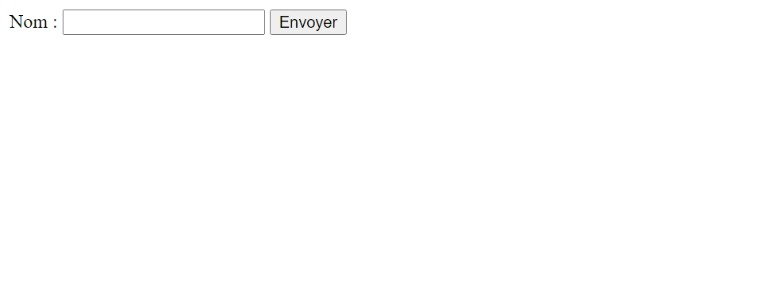

Alors une petite chose avec lequel je veux commencer sur cette vidéo pour vous présenter un moyen de rassembler par exemple vos choix de formulaires

Quand vous allez avoir des formulaires assez long ça peut être intéressant pour l'utilisateur de les ranger par section d'accord les grouper en fait par type ou par catégorie pour rendre plus facile le remplissage d'un formulaire parce que c'est quelque chose en général qui est assez redondant, c'est pas forcément quelque chose qui est très apprécié par l'utilisateur.

Plus c'est simplifié, plus c'est bien indiqué et plus ce sera vite fait pour l'utilisateur et moins casse pieds du coup donc c'est pas mal de se servir justement de ce genre de possibilités pour le faire.

Pour cela vous pouvez utiliser une balise qui s'appelle la balise `<fieldset>`.

La balise `<fieldset>` va permettre de définir une section et on pourra lui donner un titre grâce à une balise `<legend>`, ça on va le voir par la suite au niveau de cette utilisation.

Alors là évidemment j'ai pas grand grand chose d'accord au niveau de mon formulaire donc c'est sûr qu'on ne va pas avoir fait beaucoup, il n'y a pas forcément énormément de cas donc ce qu'on peut faire c'est faire un `<fieldset>` comme ceci.
```html
	<form method="post" action="">
		<fieldset>
			Nom : <input type="text" name="user_name">
			<input type="submit" name="valid_form" value="Envoyer">
		</fieldset>
	</form>
```
Alors `<fieldset>` ça peut prendre plusieurs éléments, vous pouvez lui donner un nom d'accord avec l'attribut 'name' éventuellement si ça vous sert. 

Vous pouvez le lier aussi avec le formulaire en faisant form="" et en mettant l'identifiant d'un formulaire à condition bien sûr ici d'avoir défini un 'id' d'accord.
```html
>	<form method="post" id="..." action="">
>		<fieldset form="..." >
			Nom : <input type="text" name="user_name">
			<input type="submit" name="valid_form" value="Envoyer">
		</fieldset>
	</form>
```
Je vais mettre id="id_form" et vous pouvez très bien faire ceci form="id_form" pour le lier directement pour être sûr qu'il soit vraiment bien liés à chaque fois au bon formulaire si vous vous voulez et c'est un champ qui peut évidemment dire on peut carrément désactivé l'ensemble des champs présents à l'intérieur donc en faisant tout simplement comme ceci, disabled.
```html
>	<form method="post" id="id_form" action="">
>		<fieldset form="id_form" disabled>
			Nom : <input type="text" name="user_name">
			<input type="submit" name="valid_form" value="Envoyer">
		</fieldset>
	</form>
```
Donc là par défaut si je mets juste ça, ça me met une section ici donc ça fait une représentation comme ça mais là ce ne s'est pas tellement le visuel qui nous intéresse pour le coup parce que c'est des choses qui peuvent être éventuellement modifiées par la suite comme on le verra avec css mais là avec l'attribut 'disabled' d'accord comme vous voyez je ne peux plus interagir sur le formulaire, on peut comme ça désactiver des portions en fonction donc ça peut être utile.
```html
<!doctype html>
<html lang="fr">
<head>
	<meta charset="UTF-8">
	<title>Formulaire (2/2)</title>
</head>
<body>
	<form method="post" id="id_form" action="">
		<fieldset form="id_form" disabled>
			Nom : <input type="text" name="user_name">
			<input type="submit" name="valid_form" value="Envoyer">
		</fieldset>
	</form>
</body>
</html>
```


'disabled' va être enlevé puisqu'on veut le garder et on va ajouter une légende donc vous mettez à l'intérieur du `<fieldset>`, vous mettez juste <legend> et ici vous mettez le titre d'accord, "Ma section.
```html
<!doctype html>
<html lang="fr">
<head>
	<meta charset="UTF-8">
	<title>Formulaire (2/2)</title>
</head>
<body>
	<form method="post" id="id_form" action="">
		<fieldset form="id_form">
			<legend>Ma section</legend>
			Nom : <input type="text" name="user_name">
			<input type="submit" name="valid_form" value="Envoyer">
		</fieldset>
	</form>
</body>
</html>
```


Je met Ma section pour faire un truc simple voilà.

Voilà comment ça se représente donc c'est pratiques parce que du coup vous allez pouvoir représenter différents champs en fait rapidement.

Du coup vous pourrez avoir plusieurs sections au sein de votre formulaire et rendre les choses un  peu mieux organisé au niveau du formulaire complet donc ça c'est une petite chose à savoir donc je voulais vous présenter ces deux petites balises qui seront bien évidemment très utile `<fieldset>`, `<legend>`.

Alors comme toujours tout ce que je vous présente ici dans les vidéos vous avez le pdf d'accord donc le memento html dans la description de la vidéo en téléchargement, je le mets à chaque fois à jour au fur et à mesure des séances pour que vous ayez quelque chose de plus complet et à partir de cette séance là j'ai également rajouter les balises obsolètes.

Pour information j'ai fait un tutoriel sur les balises obsolètes donc j'ai ajouté les noms de ces balises dans le pdf également pour vous éviter de les utiliser.

Si vous utilisez les balises comme `<big>`, `<center>`, `<font>`, tout ce genre de choses au moins vous saurez qu'il ne faut pas les utiliser.

Et bien évidemment je vous envoie indirectement sur mon tutoriels concernant les balises obsolètes qui pourra vous être utiles et nous allons comprendre et savoir quels balises utiliser à la place, des balises obsolète.

Voilà pour ces deux petites balises très simple d'accord pour simplement organiser nos contenus.

On va commencer maintenant à passer, on va garder du coup cet exemple là ça nous servira.

On va passer à un autre type de champ donc là on a vu un champ de saisie comme on l'a fait jusqu'à présent d'accord très simple mais admettons que vous voudriez faire un article, un forum ou je ne sais quoi quelque chose qui a besoin d'un contenu un peu plus conséquent, il sera mieux évidemment d'avoir un gros champ de saisie donc un champ carrément de textes on pourra mettre quelque chose d'un peu plus conséquent qu'ici un petit champ qui n'est pas forcément très pratique pour ce type de saisie.

Pour ça on va utiliser la balise `<textarea>`.
```html
	<form method="post" id="id_form" action="">
		<fieldset form="id_form">
			<legend>Ma section</legend>
			<p>Nom : <input type="text" name="user_name"></p>
			<p><textarea></textarea></p>
			<p><input type="submit" name="valid_form" value="Envoyer"></p>
		</fieldset>
	</form>
```
Et dans cette balise `<textarea>` vous allez pouvoir déjà au niveau de l'ouverture définir un nom, c'est toujours bien d'avoir un nom par exemple `<textarea name="article_content">` comme ça, ce genre de choses et définir éventuellement d'autres petites choses par exemple comme le nombre de lignes que va afficher en fait le champ d'accord en nombre de lignes de texte et le nombre de colonnes avec deux attributs très utile qui sont 'rows' pour le nombre de lignes par exemple vous mettez 10 et 'cols' pour le nombre de colonne par exemple 65 donc je monte déjà ce que ça donne ici à la mise à jour voilà.
```html
	<p><textarea name="article_content" rows="10" cols="65"></textarea></p>
```
Donc là je vous montre déjà ce que ça donne ici à la mise à jour.
```html
<!doctype html>
<html lang="fr">
<head>
	<meta charset="UTF-8">
	<title>Formulaire (2/2)</title>
</head>
<body>
	<form method="post" id="id_form" action="">
		<fieldset form="id_form">
			<legend>Ma section</legend>
			<p>Nom : <input type="text" name="user_name"></p>
			<p><textarea name="article_content" rows="10" cols="65"></textarea></p>
			<p><input type="submit" name="valid_form" value="Envoyer"></p>
		</fieldset>
	</form>
</body>
</html>
```


Grosso modo vous avez 10 lignes d'affichage sans scrollbar d'accord voyez on peut aller plus loin d'accord mais évidemment ça va vous mettre une scrollbar bien évidemment.

Vous avez également la possibilité de redimentionné la boîte mais ça vous pourrez la changer en css, empêcher le redimensionnement ou juste le redimensionnement horizontale ou juste verticale ou définir même une taille précise si vous voulez.

Mais toutes ces choses là comme ça concerne le design ça ne se fait évidemment pas en html et par défaut en html c'est dimensionnable comme on veut, on peut même dépassr comme vous voyez la largeur de la page sans problème.

On va laisser ça comme ça, on va actualiser la page voilà par défaut donc si vous voulez faire quelque chose de moins large, vous mettez évidemment moins de colonnes d'affichage d'accord ça va se réduire comme ça en fonction.
```html
	<p><textarea name="article_content" rows="10" cols="60"></textarea></p>
```
Donc ça c'est la base et vous pouvez mettre un texte aussi à l'intérieur par défaut voilà "Votre texte ici...".
```html
	<p><textarea name="article_content" rows="10" cols="60">"Votre texte ici..."</textarea></p>
```
```html
<!doctype html>
<html lang="fr">
<head>
	<meta charset="UTF-8">
	<title>Formulaire (2/2)</title>
</head>
<body>
	<form method="post" id="id_form" action="">
		<fieldset form="id_form">
			<legend>Ma section</legend>
			<p>Nom : <input type="text" name="user_name"></p>
			<p><textarea name="article_content" rows="10" cols="60">"Votre texte ici..."</textarea></p>
			<p><input type="submit" name="valid_form" value="Envoyer"></p>
		</fieldset>
	</form>
</body>
</html>
```
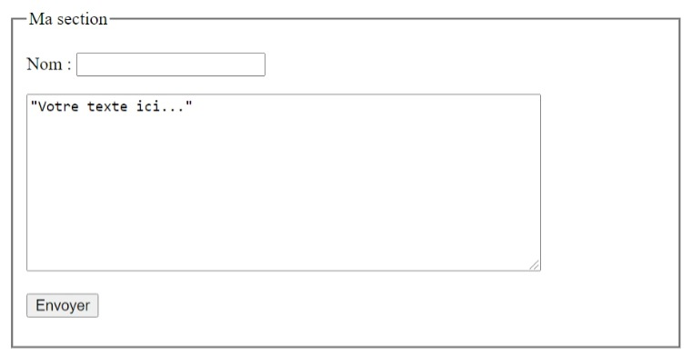

D'accord qu'il faudra bien sûr enlevé parce que c'est vraiment un texte écrit en dur.

Si vous voulez faire un texte de remplacement vous avez comme vous le savez la balise universel 'placeholder'.

Pareil pour les attributs universel j'ai fait un tutoriel dessus et donc n'hésitez pas à voir la playlist tutoriel html css.

Là du coup vous mettez comme ceci votre texte ici voilà vous mettez un 'placeholder' au lieu de mettre à l'intérieur et à l'intérieur de la balise `<textarea>` vous laisser vide.
```html
	<p><textarea name="article_content" rows="10" cols="60" placeholder="Votre texte ici..."></textarea></p>
```
Et là automatiquement voilà, et 'placeholder' vient tout simplement dans la zone de texte.
```html
<!doctype html>
<html lang="fr">
<head>
	<meta charset="UTF-8">
	<title>Formulaire (2/2)</title>
</head>
<body>
	<form method="post" id="id_form" action="">
		<fieldset form="id_form">
			<legend>Ma section</legend>
			<p>Nom : <input type="text" name="user_name"></p>
			<p><textarea name="article_content" rows="10" cols="60" placeholder="Votre texte ici..."></textarea></p>
			<p><input type="submit" name="valid_form" value="Envoyer"></p>
		</fieldset>
	</form>
</body>
</html>
```
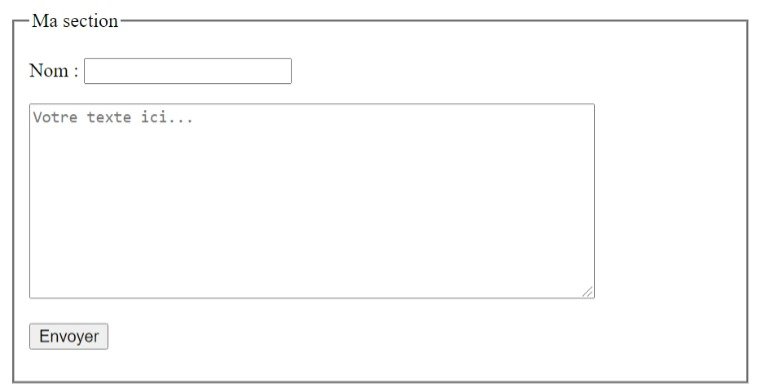

'placeholder' c'est juste une petite légende mais ce n'est pas écrit en dure au sein du champ de saisie donc ça peut être pratique pour ça.

Voilà pour cette partie là donc je vais enlever 'placeholder' parce du coup ça rallonge mes lignes comme j'ai déjà zoomer sur l'éditeur au niveau du `<textarea>` donc ça c'est vachement pratique évidemment parce que vous allez vous en servir tout le temps dans les formules, surtout quand vous allez tenir un blog, un site voilà qui va avoir besoin de rédiger, de publier du contenu vous aurez toujours ce type de cahamp utile en plus du `<input>` donc il fallait évidemment que je vous montre mais je voulais le garder pour cette vidéo parce qu'on a beaucoup parlé du `<input>` dans la précédante et il y avait vraiment pas mal de choses à faire.

Donc j'avais vraiment fait une vidéo que sur ce type de champ donc ça c'est pour la partie `<textarea>`, j'allais entamer sur la suite et on va par la suite voir ... il y a évidemment d'autres informations que vous pouvez ajouter.

Je vous ai pas donné tous les attributs c'est comme tout, n'hésitez pas à voir directement auprès de la norme w3c pour avoir le détail complet des attributs utilisable puisque vous pouvez évidemment mettre l'auto focus, vous pouvez aussi lier avec `<form>`, l'atribut `<form>` comme je l'ai montrez tout à l'heure ici avec le `<fieldset>`, vous pouvez relier votre champ a `<form>` mais ça vous pouvez le faire avec n'importe quel champ de saisie.

Vous pouvez également définir une taille alors ça je vais en parler parce que ça peut être effectivement utile, une taille minimale donc en faisant 'minlength' comme ceci, vous allez pouvoir définir le nombre minimal de caractère à entrer d'accord.
```html
	<p><textarea name="article_content" rows="10" cols="60" minlength="10" maxlength="50"></textarea></p>
```
Ce genre de chose par exemple 10 et 'maxlength' donc l'inverse si vous voulez pouvoir définir un maximum par exemple je met 20 voilà c'est tout petit mais en actualisant voilà si j'essaie d'écrire pas de soucis mais logiquement là je vais avoir une limite.
```html
<!doctype html>
<html lang="fr">
<head>
	<meta charset="UTF-8">
	<title>Formulaire (2/2)</title>
</head>
<body>
	<form method="post" id="id_form" action="">
		<fieldset form="id_form">
			<legend>Ma section</legend>
			<p>Nom : <input type="text" name="user_name"></p>
			<p><textarea name="article_content" rows="10" cols="60" minlength="10" maxlength="20"></textarea></p>
			<p><input type="submit" name="valid_form" value="Envoyer"></p>
		</fieldset>
	</form>
</body>
</html>
```
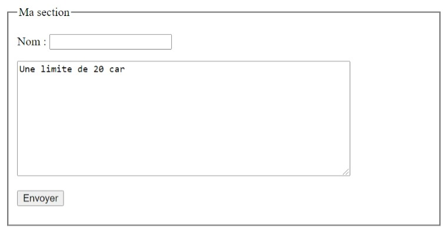

20 caracthères, alors on parle de caractère en octet d'accord c'est plus exactement des octets unicode que l'on compte par ce système là qu'autres choses après vous pourrez bien évidemment contrôler ça en fonction de ce que vous voulez donc c'est bien c'est bien savoir en tout cas ce type d'attribut là.

Vous pouvez également prévoir mais c'est pas forcément utile tout ce qui est retour à la ligne par exemple quand vous avez des mots, à quel moment il doit couper des mots ? est-ce qu'il doit les couper en plein milieu où est-ce qu'il doit du coup changer la largeur ici ou les dimensions du champ donc par défaut logiquement ça se fait bien d'accord.

Après vous pouvez vraiment forcer plus activement on va dire ce changement là donc c'est l'attribut 'wrap' et vous pouvez le mettre en "hard" voilà si vous voulez vraiment un truc qui est plus appliqué c'est à dire que là il va vraiment faire une cassure au niveau de certains mots par exemple si vous mettez une url, ce genre de choses, de manière un peu plus stricte on va dire mais par défaut c'est à "soft", vous testerez les deux de toute façons le meilleur moyen de voir comment fonctionne cet attribut c'est de le tester.
```html
	<p><textarea name="article_content" rows="10" cols="60" wrap="hard"></textarea></p>

	<p><textarea name="article_content" rows="10" cols="60" wrap="soft"></textarea></p>
```
Testez les avec des gros champs de textes et voyez comment ils se comportent, moi je ne peux pas forcément tout vous montrer dans une vidéo parce que ce serait vraiment très très long mais par défaut c'est à "soft" donc si vous voulez à "soft" vous n'êtes même pas obligé de le mettre c'est géré comme cela.

Voilà pour cette partie on va laisser comme ici.
```html
	<!doctype html>
	<html lang="fr">
	<head>
		<meta charset="UTF-8">
		<title>Formulaire (2/2)</title>
	</head>
	<body>
		<form method="post" id="id_form" action="">
			<fieldset form="id_form">
				<legend>Ma section</legend>
				<p>Nom : <input type="text" name="user_name"></p>
				<p><textarea name="article_content" rows="10" cols="60"></textarea></p>
				<p><input type="submit" name="valid_form" value="Envoyer"></p>
			</fieldset>
		</form>
	</body>
	</html>
```
Voilà pour `<textarea>` c'est tout ce qu'il y à savoir, en tout cas de d'intéressant à ce niveau là donc du coup on va rajouter d'autres petites choses comme ça c'est de compléter notre formulaire au fur et à mesure.

On va mettre ici un paragraphe `<p></p>`, nous avons un autre champ également qui va être super utile qui est le champ de  sélection multiple ou simplement de sélection par exemple un menu déroulant qui va permettre de faire un choix d'accord sur quelque chose donc ça peut être par exemple Choix système.

On va faire un retour à la ligne `<br>` voilà et ici on va  définir le champ vous allez pour cela utiliser la balise `<select>`.
```html
	<!doctype html>
	<html lang="fr">
	<head>
		<meta charset="UTF-8">
		<title>Formulaire (2/2)</title>
	</head>
	<body>
		<form method="post" id="id_form" action="">
			<fieldset form="id_form">
				<legend>Ma section</legend>
				<p>Nom : <input type="text" name="user_name"></p>
				<p><textarea name="article_content" rows="10" cols="60"></textarea></p>
>				<p>Choix système :<br>
>				<select.... </p>
				<p><input type="submit" name="valid_form" value="Envoyer"></p>
			</fieldset>
		</form>
	</body>
	</html>
```
On réduit un peu pour que ce soit plus lisible pour vous et on va mettre le champ `<select>`, on lui donner un nom en français ici évidemment bien qu'on pourrait procéder d'une autre manière pour mettre des noms en anglais si on veut mais moi je fait plus souvent ça d'ailleurs.
```html
	<!doctype html>
	<html lang="fr">
	<head>
		<meta charset="UTF-8">
		<title>Formulaire (2/2)</title>
	</head>
	<body>
		<form method="post" id="id_form" action="">
			<fieldset form="id_form">
				<legend>Ma section</legend>

>				<select name="ChoixOS">

>				</select>

				<br><input type="submit" name="valid_form" value="Envoyer">
			</fieldset>
		</form>
	</body>
	</html>
```
Et à partir de là du coup définir des options, on va pouvoir définir pas mal de petites choses.

Alors ce champ `<select>`, on peut également le relier au formulaire toujours pareil, on peut mettre un attribut 'form' pour avoir par exemple l'id du formulaire ici ça c'est quelque chose que vous pouvez faire si vous voulez vraiment être sûr qu'il est bien relié au bon formulaire en question surtout si vous en avez par exemple plusieurs sur une page, ça pourrait évidemment poser des soucis.
```html
	<!doctype html>
	<html lang="fr">
	<head>
		<meta charset="UTF-8">
		<title>Formulaire (2/2)</title>
	</head>
	<body>
		<form method="post" id="id_form" action="">
			<fieldset form="id_form">
				<legend>Ma section</legend>

>				<select name="ChoixOS" form="id_form">

				</select>

				<br><input type="submit" name="valid_form" value="Envoyer">
			</fieldset>
		</form>
	</body>
	</html>
```
Voilà pour cette partie après on a d'autres champs également on peut bien évidemment désactiver par défaut, si vous voulez  désactiver le champ de sélection.

Le 'required' c'est pour rendre le champ obligatoires mais ça pareil je n'en parle pas tout le temps parce que vous pouvez l'utiliser sur n'importe quel type de champ, sur `<input>`, sur `<textarea>` également, ça fonctionne d'accord.
```html
	<select name="ChoixOS" form="id_form" required>

	</select>
```
```html
<!doctype html>
<html lang="fr">
<head>
	<meta charset="UTF-8">
	<title>Formulaire (2/2)</title>
</head>
<body>
	<form method="post" id="id_form" action="">
		<fieldset form="id_form">
			<legend>Ma section</legend>

			<select name="ChoixOS" form="id_form" required>

			</select>

			<br><input type="submit" name="valid_form" value="Envoyer">
		</fieldset>
	</form>
</body>
</html>
```
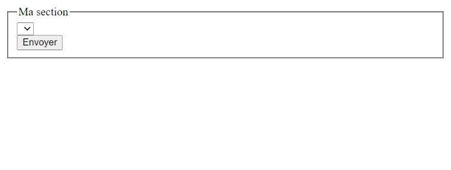

A partir de là si vous ne compléter pas ce type de champ évidemment il va vous poser problème, voyez il vous dit sectionnez un élément dans la liste, c'est géré par le navigateur.

Donc ce n'est pas une sécurité attention, ça ne va pas empêcher la personne de l'envoyer encore une fois, ça on le verra et vous le verrez en tout cas avec un langage de programmation que ce soit php, python, javascript, côté serveur.

J'entends pas côté client.

Mais voilà HTML c'est juste une petite alerte visuelle mais ça ne protège pas pour autant l'accès à notre formulaire donc attention à ce niveau là en terme de sécurité.

Je vais enlever ces parties là, on peut également désactiver  mais on s'en fiche.
```html
	<form method="post" id="id_form" action="">
		<fieldset form="id_form">
			<legend>Ma section</legend>

			<select name="ChoixOS">

			</select>

			<br><input type="submit" name="valid_form" value="Envoyer">
		</fieldset>
	</form>
```
Et à l'intérieur, on va rajouter nos options donc les options vous allez utiliser la balise qui s'appelle `<option>` tout simplement et vous avez lui mettre une valeur par exemple je vais mettre Windows, GNU/Linux, MacOS.
```html
	<select name="ChoixOS" form="id_form" required>
		<option>Windows</option>
		<option>GNU/Linux</option>
		<option>MacOS</option>
	</select>
```
```html
<!doctype html>
<html lang="fr">
<head>
	<meta charset="UTF-8">
	<title>Formulaire (2/2)</title>
</head>
<body>
	<form method="post" id="id_form" action="">
		<fieldset form="id_form">
			<legend>Ma section</legend>

			<select name="ChoixOS" form="id_form" required>
				<option>Windows</option>
				<option>GNU/Linux</option>
				<option>MacOS</option>
			</select>

			<br><input type="submit" name="valid_form" value="Envoyer">
		</fieldset>
	</form>
</body>
</html>
```


Voilà ce genre de choses donc ça c'est vraiment par défaut d'accord c'est vraiment le type par défaut du champ qu'on peut faire, on peut éventuellement parce que si vous allez plus tard envoyer le formulaire, vous verrez surtout avec un langage de programmation, vous allez récupérer la valeur de ce qui a ici d'accord dans la partie textuel.

Dans certains cas, vous n'avez peut être pas envie de récupérer ça, a tester comme valeur parce que voyez que c'est des textes assez particulier.

Vous avez peut-être envie de faire un texte un peu mieux formater pour que ce soit plus pratique après faire vos tests en terme de programmation je dirais avec un langage back-end.

Dans ce cas là vous pouvez utiliser l'attribut 'value' et là par exemple on pourrait dire bah oui "win" du coup c'est plus court puis vous pouvez mettre juste "linux" pour éviter d'avoir un slash etc et puis là vous pouvez carrément mettre "mac" bref ce que vous voulez et c'est ça qui sera envoyée au niveau du formulaire.
```html
	<select name="ChoixOS">
		<option value="win">Windows</option>
		<option value="linux">GNU/Linux</option>
		<option value="mac">MacOS</option>
	</select>
```
```html
<!doctype html>
<html lang="fr">
<head>
	<meta charset="UTF-8">
	<title>Formulaire (2/2)</title>
</head>
<body>
	<form method="post" id="id_form" action="">
		<fieldset form="id_form">
			<legend>Ma section</legend>

			<select name="ChoixOS">
				<option value="win">Windows</option>
				<option value="linux">GNU/Linux</option>
				<option value="mac">MacOS</option>
			</select>

			<br><input type="submit" name="valid_form" value="Envoyer">
		</fieldset>
	</form>
</body>
</html>
```


Evidemment on ne verra pas ça le traitement des données en html puisque ça ne se fait pas en html ni en css, ça se fait encore une fois avec un langage de programmation côté serveur donc si vous suivez une formation par exemple en php ou en langage de back-end pour le web, vous apprendrez justement à traiter les formulaires et vous verrez que c'est ça que nous récupérons du coup donc aucune différence bien évidemment visuel c'est purement au niveau de traitement des données que ça a un intérêt.


Ce qu'on peut faire aussi que j'ai pas montrer, c'est que vous pouvez ici définir un attribut 'size' qui permet de choisir vous allez voir je vais augmenterez à 2 et je vais vous montrer visuellement ce que ça fait.
```html
	<select name="ChoixOS" size="2">
		<option value="win">Windows</option>
		<option value="linux">GNU/Linux</option>
		<option value="mac">MacOS</option>
	</select>
```
```html
<!doctype html>
<html lang="fr">
<head>
	<meta charset="UTF-8">
	<title>Formulaire (2/2)</title>
</head>
<body>
	<form method="post" id="id_form" action="">
		<fieldset form="id_form">
			<legend>Ma section</legend>

			<select name="ChoixOS" size="2">
				<option value="win">Windows</option>
				<option value="linux">GNU/Linux</option>
				<option value="mac">MacOS</option>
			</select>

			<br><input type="submit" name="valid_form" value="Envoyer">
		</fieldset>
	</form>
</body>
</html>
```
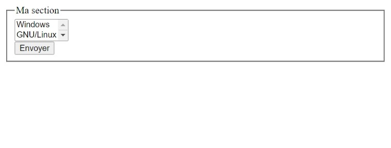

J'ai mis 'zise' égal à 2 et la voilà vous voyez que tout simplement il affiche par défaut en fait deux parties du champ d'accord donc y en a évidemment toujours 3 mais par défaut il va en afficher 2, ça c'est un petit plus d'accord, ça peut être sympa des fois d'afficher plusieurs choses comme ça plutôt qu'un seul champ donc pourquoi pas.

Alors j'essaye de ne rien oublier puisque sur `<select>` il n'y a pas mal de choses à dire donc je ne veux pas aller trop vite parce qu'on peut vite faire des bêtises et oublier la moitié des choses, alors qu'est ce qu'on peut également définir ? on peut définir aussi un label effectivement pour le `<option>` mais c'est pas non plus très très utilisé mais vous avez l'attribut 'label' bien évidemment qui est utilisable ici.
```html
	<option label=""></option>
```
Un autre cas et là ça peut être évidemment pas mal utile si vous avez besoin comme vous avez vu ici avec le 'fieldset' qui permettait de grouper des parties de notre formulaire au niveau d'un champ de sélection, on peut regrouper des champs justement a sélectionner.

Pour ça ce qu'on peut faire c'est des groupes donc ici par exemple je vais mettre le nom "choixJeu" donc là je change un peu le type on va faire `<optgroup>` d'accord et ici option group on va lui mettre par contre un 'label', là ça va être pour le coup vachement utile et on va mettre par exemple "RPG".
```html
	<select name="ChoixJeu">
		<optgroup label="RPG"></optgroup>
	</select>
```
"RPG" je vous montrez pourquoi je fais ça donc vous vous êtes dans `<optgroup>` et à l'intérieur vous mettez `<option>`.
```html
	<select name="ChoixJeu">
		<optgroup label="RPG">
			<option></option>
		</optgroup>
	</select>
```
Alors on peut également parce que tout à l'heure vous avez vu qu'il y avait une valeur textuel ... si au final ce que vous mettez dans 'value' se suffit cette balise peut fonctionner également comme ceci càd que ça peut être également une balise orpheline donc vous mettez `<option value="Final Fantasy">` tout simplement voilà.
```html
	<select name="ChoixJeu">
		<optgroup label="RPG">
			<option value="Final Fantasy">
		</optgroup>
	</select>
```
Parce que si au final dans le texte, vous avez la même chose d'accord genre vous auriez ceci.
```html
	<select name="ChoixJeu">
		<optgroup label="RPG">
			<option value="Final Fantasy">Final Fantasy</option>
		</optgroup>
	</select>
```
Je vous montre voilà ça c'est redondant voyez 'value' est égal à ce qu'il y a ici au niveau textuel donc cette partie là du coup vous pouvez l'omettre, vous pouvez l'enlever ça va déjà économiser quelques lignes au niveau de votre fichier et au moins c'est beaucoup plus court donc on pouvait marquer les choses comme ça.
```html
	<select name="ChoixJeu">
		<optgroup label="RPG">
			<option value="Final Fantasy">
		</optgroup>
	</select>
```
Alors je mets pas mal de choses histoire d'avoir un exemple à montrer, et on va mettre deux options groupes.
```html
	<select name="ChoixJeu">
		<optgroup label="RPG">
			<option value="Final Fantasy">
			<option value="The Legend of Zelda">
		</optgroup>
		<optgroup label="FPS">
			<option value="CS:GO">
			<option value value="Fortnite">
		</optgroup>
	</select>
```
On va faire ça voilà, on actualise et là voilà ce qu'on a.
```html
<!doctype html>
<html lang="fr">
<head>
	<meta charset="UTF-8">
	<title>Formulaire (2/2)</title>
</head>
<body>
	<form method="post" id="id_form" action="">
		<fieldset form="id_form">
			<legend>Ma section</legend>

			<select name="ChoixJeu">
				<optgroup label="RPG">
					<option value="Final Fantasy">
					<option value="The Legend of Zelda">
				</optgroup>
				<optgroup label="FPS">
					<option value="CS:GO">
					<option value value="Fortnite">
				</optgroup>
			</select>

			<br><input type="submit" name="valid_form" value="Envoyer">
		</fieldset>
	</form>
</body>
</html>
```
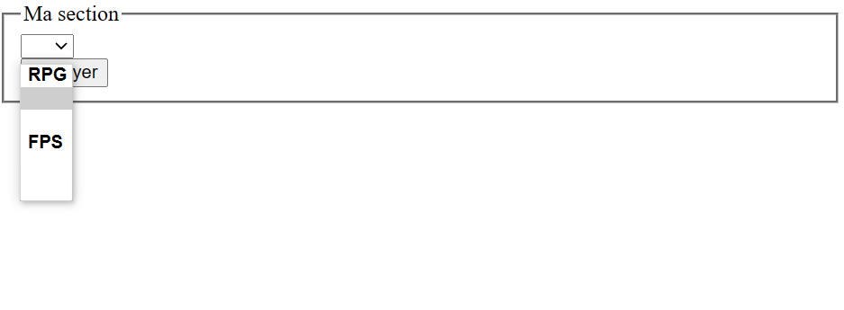

Alors c'est génial il nous met des textes par défaut ici en blanc c'est très beau mais il va peut être vouloir que je l'affiche quand même en fait au niveau de l'option du coup on va le remettre c'est pas grave, apparemment au niveau de l'aspect visuel chrome n'aime pas ça.
```html
<!doctype html>
<html lang="fr">
<head>
	<meta charset="UTF-8">
	<title>Formulaire (2/2)</title>
</head>
<body>
	<form method="post" id="id_form" action="">
		<fieldset form="id_form">
			<legend>Ma section</legend>

			<select name="ChoixJeu">
				<optgroup label="RPG">
					<option value="Final Fantasy">Final Fantasy</option>
					<option value="The Legend of Zelda">The Legend of Zelda</option>
				</optgroup>
				<optgroup label="FPS">
					<option value="CS:GO">CS:GO</option>
					<option value value="Fortnite">Fortnite</option>
				</optgroup>
			</select>

			<br><input type="submit" name="valid_form" value="Envoyer">
		</fieldset>
	</form>
</body>
</html>
```


Voilà donc on va juste mettre comme ceci voyez comme on a fait aux débuts et là du coup vous avez comme ça des options d'accord des groupes pour rassembler certains types de champs de saisie ici à la sélection de votre champ `<select>` donc ça c'est quand même vachement utile, ça vous permet comme ça de bien grouper les choses quand vous avez notamment beaucoup beaucoup beaucoup de champs de sélection.

C'est utile de procéder comme ça.

Il y a une petite option aussi qui est utile à savoir c'est que là vous pouvez mettre l'attribut ici qui ne prend pas de valeur 'multiple' et vous allez tout simplement pouvoir sélectionner plusieurs chanps.
```html
>	<select name="ChoixJeu" multiple>
		<optgroup label="RPG">
			<option value="Final Fantasy">Final Fantasy</option>
			<option value="The Legend of Zelda">The Legend of Zelda</option>
		</optgroup>
		<optgroup label="FPS">
			<option value="CS:GO">CS:GO</option>
			<option value value="Fortnite">Fortnite</option>
		</optgroup>
	</select>
```
```html
<!doctype html>
<html lang="fr">
<head>
	<meta charset="UTF-8">
	<title>Formulaire (2/2)</title>
</head>
<body>
	<form method="post" id="id_form" action="">
		<fieldset form="id_form">
			<legend>Ma section</legend>

			<select name="ChoixJeu" multiple>
				<optgroup label="RPG">
					<option value="Final Fantasy">Final Fantasy</option>
					<option value="The Legend of Zelda">The Legend of Zelda</option>
				</optgroup>
				<optgroup label="FPS">
					<option value="CS:GO">CS:GO</option>
					<option value value="Fortnite">Fortnite</option>
				</optgroup>
			</select>

			<br><input type="submit" name="valid_form" value="Envoyer">
		</fieldset>
	</form>
</body>
</html>
```
Donc ça se met par défaut comme ça et là vous pouvez sélectionner plusieurs chanps d'accord à l'intérieur.
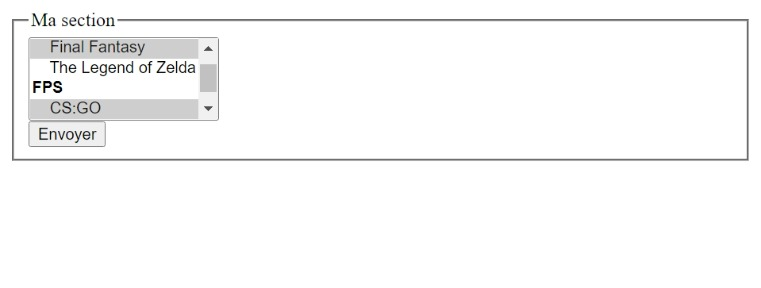

Alors pour le faire il suffit d'appuyer sur la touche ctrl d'accord vous rester sur la touche ctrl est là vous voyez je peux sélectionner plusieurs champs.

On ne peut évidemment pas sélectionner ça "RPG", "FPS" parce que c'est un label de groupe donc ça n'a rien à voir mais vous pouvez par exemple sélectionner les 4 et envoyer les 4.

C'est tout à fait possible par ce procédé là mais par défaut ça sélectionnera de toute façon un seul.

Donc ça c'est pareil j'en parle rapidement parce que c'est à savoir ça peut avoir son utilité à ce niveau.

Qu'est-ce qu'on peut également utiliser avec les `<option>` ? toujours pareil vous pouvez désactiver bien sûr une option particulière genre par exemple vous ne voulez plus que cette option soit récupérable et bien vous mettez à 'disabled'.
```html
	<option value="CS:GO" disabled>CS:GO</option>
```
```html
<!doctype html>
<html lang="fr">
<head>
	<meta charset="UTF-8">
	<title>Formulaire (2/2)</title>
</head>
<body>
	<form method="post" id="id_form" action="">
		<fieldset form="id_form">
			<legend>Ma section</legend>

			<select name="ChoixJeu">
				<optgroup label="RPG">
					<option value="Final Fantasy">Final Fantasy</option>
					<option value="The Legend of Zelda">The Legend of Zelda</option>
				</optgroup>
				<optgroup label="FPS">
					<option value="CS:GO" disabled>CS:GO</option>
					<option value value="Fortnite">Fortnite</option>
				</optgroup>
			</select>

			<br><input type="submit" name="valid_form" value="Envoyer">
		</fieldset>
	</form>
</body>
</html>
```
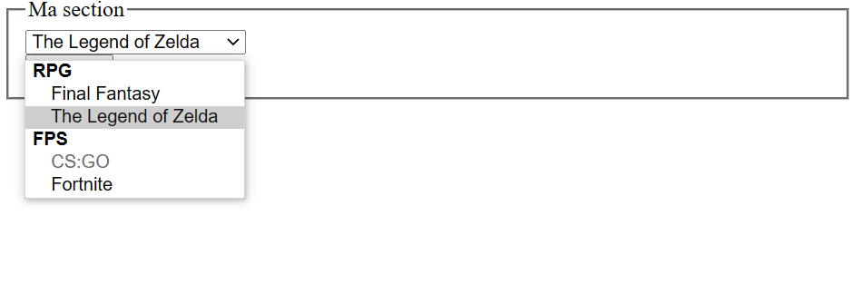

Ca évidemment c'est des choses qu'on a déjà vu aussi voilà on ne peut plus sélectionner "CS:GO", on peut sélectionner que les 3 autres donc ça c'est des petits attributs que vous pouvez utiliser sur pas mal pas mal de champs ou notamment pas mal de balises en tout cas au niveau html en particulier pour les formulaires donc vous avez pas mal de choix à ce niveau-là.

Ca c'est bon pour cette partie là, je vais terminer sur un petit plus également au niveau des champs de sélection donc c'est encore un petit plus.

Alors par contre je vous déconseille d'utiliser, je vous le montre parce que c'est pas obsolète donc ça fait partie du standard en revanche ce n'est pas actuellement compatible avec ceux qui utilisent le navigateur safari donc si vous utilisez safari sur MacOS et si vous avez ce type de champ là ça ne fonctionnera pas chez eux, ce qui peut être assez problématique parce que c'est quand même un navigateur qui est utilisé.

Voilà il faut privilégier en tout cas ce qui fonctionne chez tout le monde plutôt que ce qui va par exemple sélectionner certaines personnes.

Donc ce type de balises, c'est la balise `<datalist>` d'accords la balise `<datalist>` va s'utiliser très simplement en faisant ceci.
```html
	<input ...>
```
Déjà je vais utiliser un `<input>` d'accord et je vais mettre un attribut 'list' ok donc ça je vais mettre comme tout à l'heure donc "ChoixJeu" ce genre de chose.
```html
	<input list="ChoixJeu">
```
Donc je peux juste rester à ça donc j'ai même pas besoin de mettre plus que ça.

Eventuellement on peut mettre un 'label' ou juste un champ comme ça il n'y a pas de souci.
```html
	Choisir un jeu : <input list="ChoixJeu">
```
Et là du coup ce qu'on va faire c'est définir `<datalist>` en dessous de toute façon on ne la verra pas affichée.

Vous mettez un `<datalist>` d'accords comme ceci et le `<datalist>` va prendre un certain type de champ notamment et ça c'est super important un "id" d'accord.
```html
	Choisir un jeu : <input list="ChoixJeu">
	<datalist id="">
```
L'identifiant doit être tout simplement la valeur de l'attribut 'list' du champ de saisie en question et je vais vous montrer à quoi ça sert voilà.
```html
	Choisir un jeu : <input list="ChoixJeu">
	<datalist id="ChoixJeu">
	
	</datalist>
```
Ici on définit des options alors en mettant juste ça, il est censé me l'afficher quand même. C'était juste pour le `<select>` où il faut compléter le `<option>` par contre pour le `<datalist>` vous n'êtes obligé, vous pouvez mettre juste `<option value="">` comme je vous l'ai montré tout à l'heure.
```html
	Choisir un jeu : <input list="ChoixJeu">
	<datalist id="ChoixJeu">
		<option value="CS:GO">
	</datalist>
```
```html
<!doctype html>
<html lang="fr">
<head>
	<meta charset="UTF-8">
	<title>Formulaire (2/2)</title>
</head>
<body>
	<form method="post" id="id_form" action="">
		<fieldset form="id_form">
			<legend>Ma section</legend>

			Choisir un jeu : <input list="ChoixJeu">
			<datalist id="ChoixJeu">
				<option value="CS:GO">
			</datalist>

			<br><input type="submit" name="valid_form" value="Envoyer">
		</fieldset>
	</form>
</body>
</html>
```


Voilà juste `<option value="">`.

On va faire ça, on va mettre un autre champ quand même donc admettons vous mettez quelques valeurs ici d'accord au niveau de votre champ et la différence comparé à ce qu'on a fait tout à l'heure d'accords déjà voyez qu'il est un petit peu différent au niveaux aspect.
```html
	Choisir un jeu : <input list="ChoixJeuNum2">
	<datalist id="ChoixJeuNum2">
		<option value="CS:GO">
		<option value="Final Fantasy">
	</datalist>
```
```html
<!doctype html>
<html lang="fr">
<head>
	<meta charset="UTF-8">
	<title>Formulaire (2/2)</title>
</head>
<body>
	<form method="post" id="id_form" action="">
		<fieldset form="id_form">
			<legend>Ma section</legend>

			Choisir un jeu : <input list="ChoixJeuNum2">
			<datalist id="ChoixJeuNum2">
				<option value="CS:GO">
				<option value="Final Fantasy">
			</datalist>

			<br><input type="submit" name="valid_form" value="Envoyer">
		</fieldset>
	</form>
</body>
</html>
```
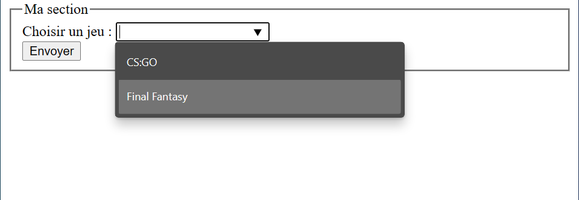

Vous voyez qu'il est déjà un peu différent au niveau aspect, c'est que les gens vont pouvoir choisir dans le champ ici de sélection une valeur qui existe et si jamais par exemple il veulent choisir un autre jeu donc là pour l'exemple que j'ai donnée qui n'est pas dans la liste ils peuvent le rentrer eux-mêmes d'accord voilà et c'est ce champ là qui va être envoyé.
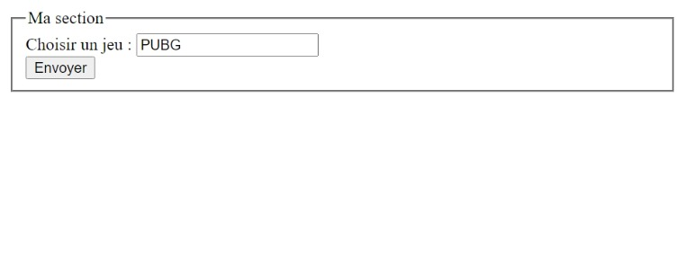

Et c'est ce chanp là qui va être envoyé donc ça permet en fait d'avoir un champ de sélection parmi un choix possible qui est proposé mais si dans cette liste le choix de l'utilisateur qu'il veut n'est pas disponible, il va pouvoir le saisir lui-même donc attention encore une fois cela n'est pas compatible sur safari à l'heure actuelle où je fait cette vidéo, si vous êtes sur safari ce type de champ ne fonctionnera pas comme il faut donc à éviter évidemment dans la mesure du possible.

Privilégiez le champ normal d'accord le sélect `<select>` qui fonctionne très bien mais c'est à savoir parce qu'il n'est pas encore une fois obsolète donc vous pouvez l'utiliser quand même mais à vous à vos risques.

Voilà pour tous ceux qui sont sur safari ne vont pas être très content par rapport à ça.

Voilà pour la partie champs de section.

Là grosso modo sur cette vidéo on a vu voilà comment organiser nos éléments, on a vu tout ce qui était le champ de texte, un peu plus allongé, un peu plus grand que le champ de saisie simple et l'utilisation de champ de sélection qui sont quand même vachement utile également sur nos formulaires.

En bonus de cette vidéo et pour terminer avec ça je vais vous parler très rapidement et ça va aller très vite puisque on pourra pas l'exploiter vraiment, c'est la balise `<button>`.

La balise `<button>`, je vais vous montrer et je vais carrément viré même le `<form>` puisque on n'est pas forcément obligé d'utiliser ça.
```html
	<!doctype html>
	<html lang="fr">
	<head>
		<meta charset="UTF-8">
		<title>Formulaire (2/2)</title>
	</head>
	<body>
		<button></button>
	</body>
	</html>
```
On va utiliser ce type là comme mettre par exemple cliquez ici et voilà comment ça fonctionne par défaut.
```html
	<!doctype html>
	<html lang="fr">
	<head>
		<meta charset="UTF-8">
		<title>Formulaire (2/2)</title>
	</head>
	<body>
		<button>Cliquez ici</button>
	</body>
	</html>
```
On peut lui définir un type donc 'type', moi je vais mêttre "button" parce que c'est comme ça que ça fonctionne en standard.
```html
<!doctype html>
<html lang="fr">
<head>
	<meta charset="UTF-8">
	<title>Formulaire (2/2)</title>
</head>
<body>
	<button type="button">Cliquez ici</button>
</body>
</html>
```
On peut également bon le mettre dans plusieurs autres type d'accord on peut le gérer de plusieurs manières différentes et ce type de balise pourra être utilisé plus tard avec un langage par exemple comme le javascript d'accord.

Vous pourrez gérer les événements javascript sur ce type de champ sans forcément utiliser un formulaire par exemple au moment où vous allez cliquer sur le bouton ça va déclencher certaines actions, ça peut être utile.


Là par défaut, mon bouton il fait rien du tout d'accord c'est bien il a un texte mais il ne fait rien.

Donc je ne vais pas vous montrer puisque on ne fait pas de javascript sur cette formation il y aura une formation qui n'est pas encore faite au moment je fais cette vidéo en javascript sur la chaîne donc vous aurez l'occasion dé retrouver quand elle sera démarrée, publiée mais en attendant voilà il faudra vous contenter de ça pour cette partie là.

Alors on peut gérer évidemment comme un formulaire, on peut très bien lui dire par exemple 'formmethod' pour le mettre par exemple en "POST" ou "GET" ce genre de choses.
```html
	<!doctype html>
	<html lang="fr">
	<head>
		<meta charset="UTF-8">
		<title>Formulaire (2/2)</title>
	</head>
	<body>
		<button formmethod="POST" type="button">Cliquez ici</button>
	</body>
	</html>
```
On peut définir aussi une action 'formaction' d'accord genre ma page, une nouvelle page en fait ce genre de choses.
```html
	<!doctype html>
	<html lang="fr">
	<head>
		<meta charset="UTF-8">
		<title>Formulaire (2/2)</title>
	</head>
	<body>
		<button formmethod="POST" formaction="mapage.html" type="button">Cliquez ici</button>
	</body>
	</html>
```
Et 'type', on peut mettre par exemple "submit" d'accord et là il va fonctionner, il va réagir en fait comme un formulaire ce bouton d'accord càd que là on n'a pas de balise `<form>` mais il va fonctionner comme un formulaire et ainsi si je clique-là, je vais envoyer le formulaire donc c'est plutôt sympa au niveau de l'utilité de ce type de champ.
```html
<!doctype html>
<html lang="fr">
<head>
	<meta charset="UTF-8">
	<title>Formulaire (2/2)</title>
</head>
<body>
	<button formmethod="POST" formaction="mapage.html" type="submit">Cliquez ici</button>
</body>
</html>
```


Alors là vous n'aurez pas forcément l'utilité ce qui est normal, c'est surtout encore une fois utiles avec un langage comme par exemple javascript ça peut pas mal servir ou même dans d'autres langages pour gérer des événements mais je voulais vous présenter pour que vous sachiez que cette balise existe.

`<button>`, je l'ai également mise dans le pdf que vous avez dans la description de vidéos donc voilà histoire que vous sachiez que ça existe, que c'est pas une mauvaise balise ou qui a été inventé par je ne sais qui, elle fait bien partie du langage html.

Et voilà pour cette partie en tout cas pour cette séance numéro 10 consacrée au formulaire qui du coup termine avec ce que je voulais vous montrer sur les formulaires justement.

Pour la suite on va commencer à parler de médias donc on va voir comment gérer des images d'accord des images avec des légendes et on arrivera aussi par la suite sur tout ce qui concerne l'audio et la vidéo d'accord parce que ça en html,  il y a beaucoup de petites choses aussi par rapport à ça, pour afficher des vidéos, pour gérer des musiques, pour afficher des images tout simplement patce que vous avez vu que je vous l'ai pas montré encore donc c'est très simple à faire mais je voulais bien évidemment qu'on a vu tout ce qu'on a vu avant, tout ce qui concerne surtout du texte, du formatage, tout ça avant d'attaquer tout ce qui est partie média d'accord média de manière générale.

Je vous dis à bientôt n'hésitez pas à commenter, à poser des questions si quelque chose n'était pas suffisamment clair sur tout mais ça c'est vraiment un conseil que je vous donne en html css, faites des pages, faites des pages web, testez plusieurs types de balises, d'attributs, et cetera, mélangez  les, voyez un petit peu comment elles se comportent.

C'est vraiment le meilleur moyen de voir comment elles fonctionnent d'accord l'aspect théorique c'est bien mais il faut également pratiquer surtout dans ce genre de cas pour comprendre comment ça fonctionne et l'avantage du html, du css comme vous verrez par la suite c'est que c'est beaucoup du visuel également donc vous pouvez très vite comprendre comment fonctionnent les choses en voyant le résultat que vous obtenez sur vos pages web.

Voilà voilà à bientôt on se retrouvera pour la séance numéro 11.

A bientôt tout le monde