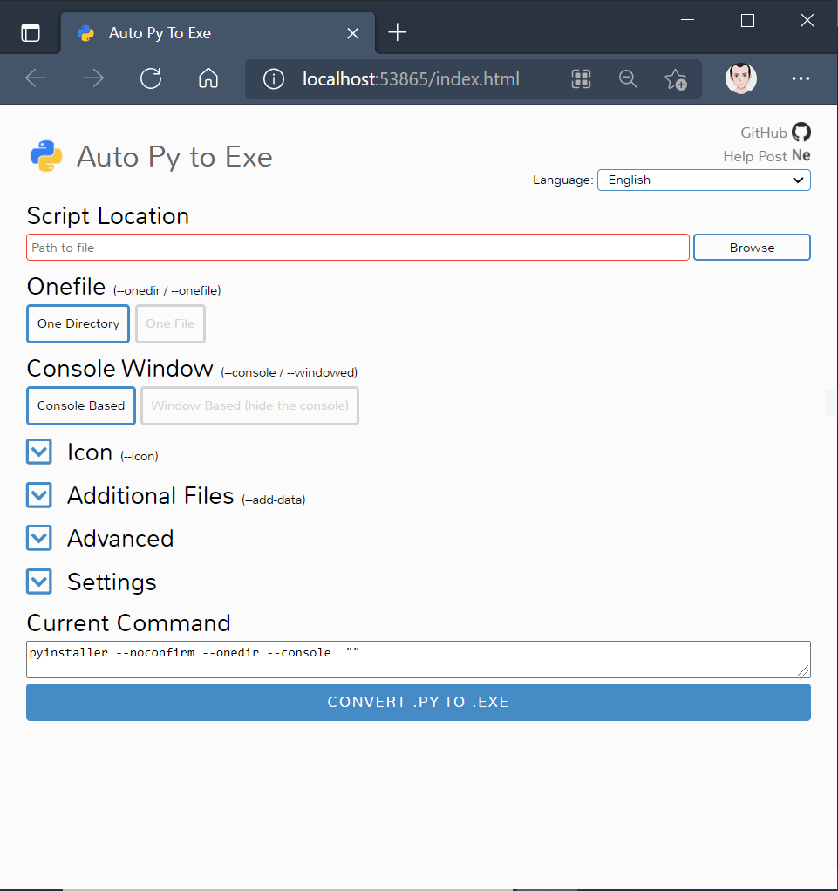
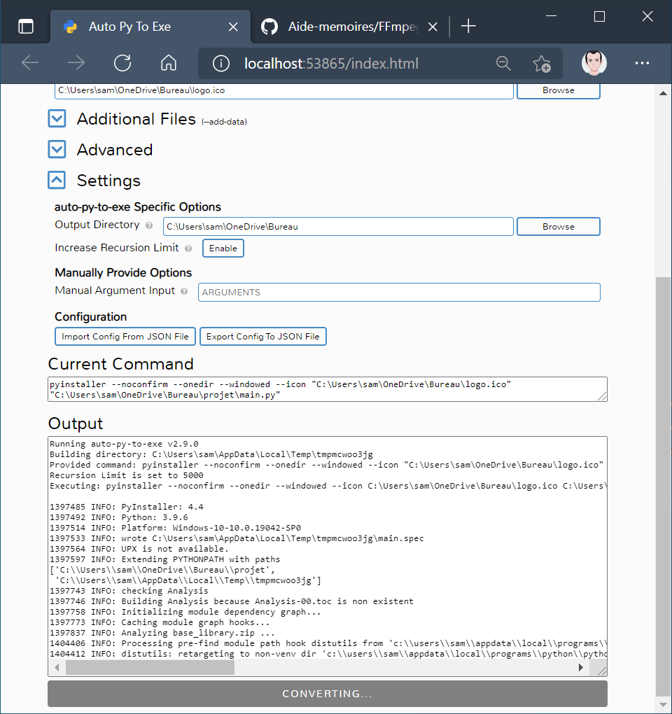

# [Créer un exécutable](https://www.youtube.com/watch?v=Jji2ik_AQOg)

Utilisation de l'outil auto-py-to-exe. Il installe pyinstaller (outil principal) qui s'utilise principalement en ligne de commandes et lui va passer par un environnement graphique depuis une interface web et installer un tas d'outils en même temps.

https://pypi.org/project/auto-py-to-exe/

```powershell
>pip install auto-py-to-exe
Collecting auto-py-to-exe
  Downloading auto_py_to_exe-2.9.0-py2.py3-none-any.whl (81 kB)
     |████████████████████████████████| 81 kB 2.6 MB/s
Collecting pyinstaller>=4.1
  Downloading pyinstaller-4.4-py3-none-win_amd64.whl (2.0 MB)
     |████████████████████████████████| 2.0 MB 3.3 MB/s
Collecting Eel==0.12.4
#...
```

On va écrire un projet pour avoir quelque chose d'assez conséquent, un application tkinter qui execute une instance de pygame.

On crée deux scripts main.py et game.py

+ main.py
```py
import game
import tkinter

def open():
    game.run()

app = tkinter.Tk()
app.title("Mon app tkinter")
app.geometry("300x100")

lb = tkinter.Label(app, text="Cliquer sur le bouton...").pack()
bt = tkinter.Button(app, text="Hack tkinter", command=open).pack()

app.mainloop()
```
+ game.py
```py
import pygame

def run():
    pygame.init()

    screen = pygame.display.set_mode([400, 400])

    launched = True
    while launched:
        for event in pygame.event.get():
            if event.type == pygame.QUIT:
                launched = False

        screen.fill((12, 25, 38))
        pygame.draw.line(screen, (128, 25, 240), [10, 10], [280, 310], 3)
        pygame.display.flip()

    pygame.quit()
```
```powershell
> python main.py
pygame 2.0.1 (SDL 2.0.14, Python 3.9.6)
Hello from the pygame community. https://www.pygame.org/contribute.html
```

Les projet est prêt et on veut empackter ça pour le distribuer à quelqu'un qui n'aurais pas d'interprêteur Python.

```powershell
>auto-py-to-exe.exe
```



Voilà une on a une interface web qui a démarré en étant connecter sur un serveur et maintenant nous allons pouvoir tout configurer.

* Script Location : C:\Users\sam\OneDrive\Bureau\projet\main.py
* Onefile : One Directory
(*One file* si on a qu'un seul fichier)

Noté qu'on peut utiliser `pyinstaller` en commande ce qui reviens au même et qui utilise parfois d'autres outils suivant les modules que contient notre application Python du coup la commande peut être plus étoffée.

* Console Window : Window Based (hide the console)

Noté que cette option c'est pour avoir un programme en console *Console Based* mais pour avoir un programme fenêtré, il faut utiliser le mode *Window Based* comme ça on exécute `python w` en console...

* Settings > auto-py-to-exe Specific Options > Output Directory : C:\Users\sam\OneDrive\Bureau

* Icon : C:\Users\sam\OneDrive\Bureau\logo.ico
```powershell
>ffmpeg -i logo.PNG logo.ico
```

C'est parti pour la conversion...



Voilà on récupère un dossier main sur le bureau avec notre exécutable main.exe reconnaissable au logo. Sans cette convertion, il faut que notre interlocuteur installe l'interprêteur de son coté sinon le dossier main peut être zippé et partagé.

Voilà pour enpackter et distribuer nos programmes facilement avec l'outil auto-py-to-exe.